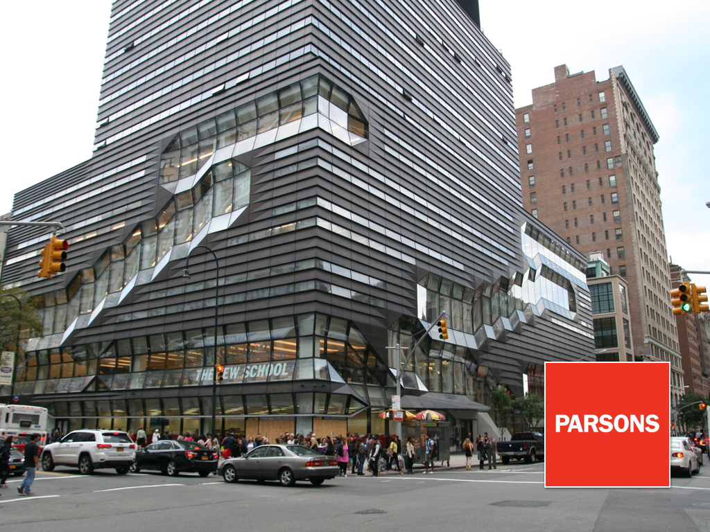
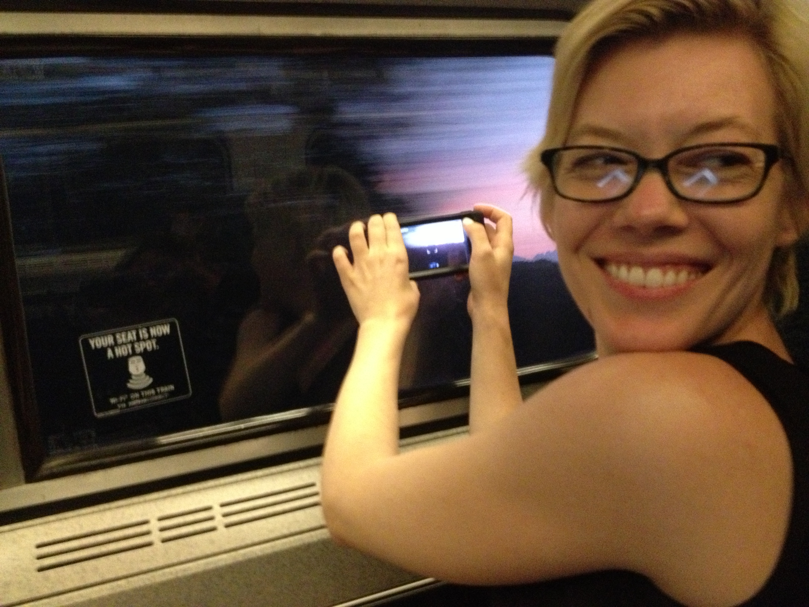
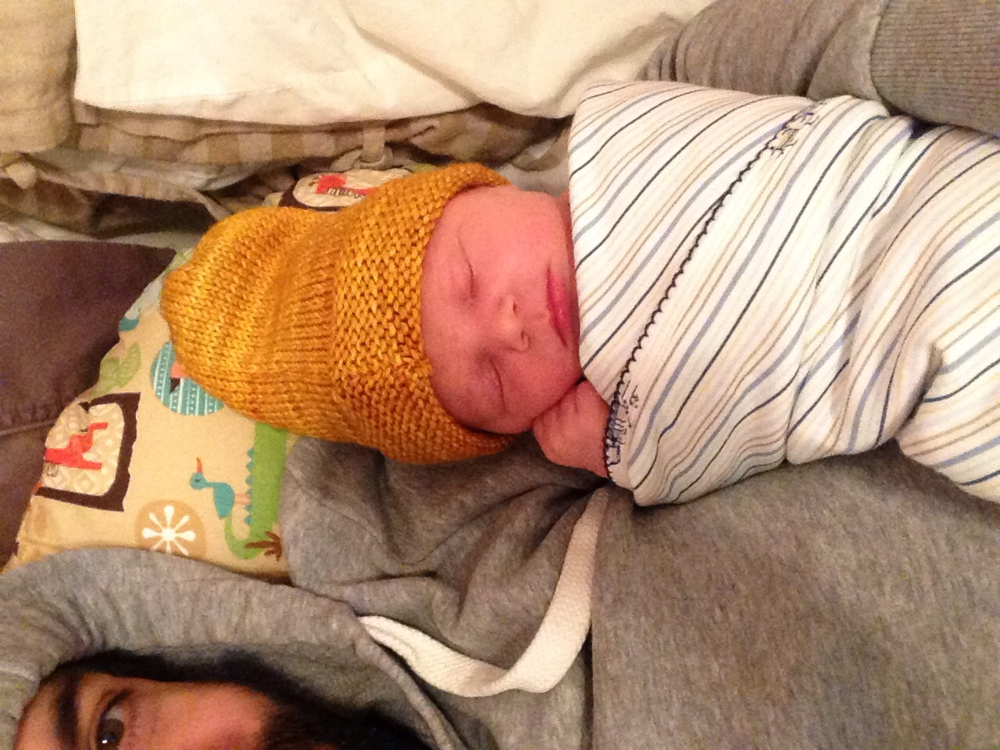
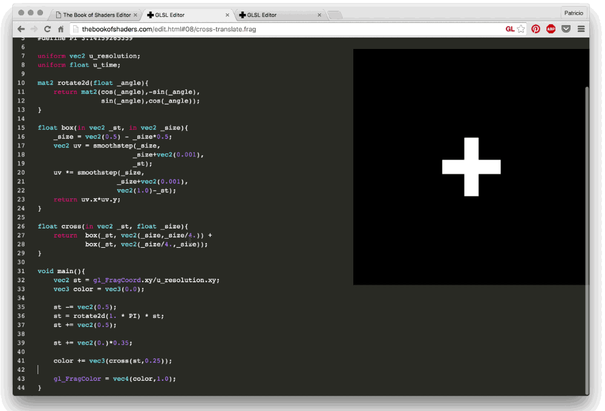
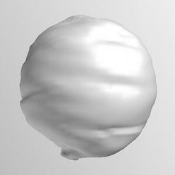
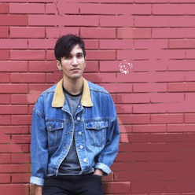
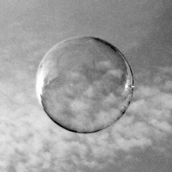
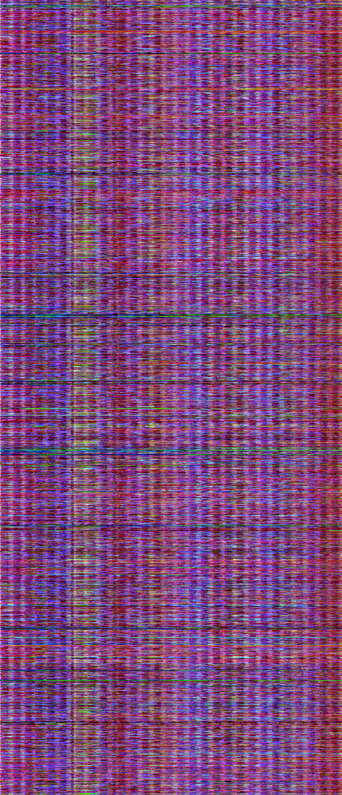

**Patricio Gonzalez Vivo**

[patricio.io](http://patricio.io) | [@patriciogv](https://twitter.com/patriciogv)

---

<!-- .slide: data-background="#000000" -->
June 2011

Note:
2011 June 04, a vulcano named Puyehue makes eruptuion at the south of Chile.

--

<!-- .slide: data-background="#000000" -->


--

<!-- .slide: data-background="#000000" -->


Note:
Theys after, plume travels all the way to Buenos Aires. In it path's, brings destruction, disruption and unpredictable consecuences to landscape and the living forms that habite it.

Mean while, I was transitioning from my practice on clinical psichology & expressive art therapy to digital art.
I was working on an interactive peace about the Butterfly Effect, produce by human interaction with the enviroment. Simulating an ecosystem on a sanbox, that invites people to intervine it but makeing visible how unpredictable and destructive this interventions could be.

--

<!-- .slide: data-background="#000000" -->


Note:
This was my first prototype. Rapidly I run out resources by the amount of pixel by pixel operations I need to make. The solution was to teach my self shaders.

--

<!-- .slide: data-background="#000000" -->


Note:
They provide the computational power to simulate different layers in modules and combine them in an efficient and state of the art way.
On that there were not any system like that, neither enought information about shaders.
Comming from clinical psichology, was a challenge to teach my self how to use them.

--

<!-- .slide: data-background="#000000" -->


**Efecto Mariposa** (Butterfly effect)

Note:
I end up incorporating the volcanic ashes to it. Beside been a perfect mapping surface I found it simbolically intune with the work. Those ashes, that cause so much disruption, bring an extra intangible meaning to the peace.
This works got a lot of recognition in Latin America. I was invited to File and other festivals to show it.
I will, is not easy to transport volcanic ashes by plane.

--


Note:
I decide to open source source the modules I use for the simulation into an openFrameworks addons. So other artist don't have to struggle to learn this technology. People love it! It become one of the popular once.

--

<!-- .slide: data-background="#000000" -->
January 2012

Note:
On January 2012 I made a trip to visit NYC. I send a email to Zach. How at that same time was having troubles compiling my addon.

--

<!-- .slide: data-background="#000000" -->


Note:
We meet and we talk mostly about life. He toldme he resently got merry and his life was changing in this new fascinatings ways.
I told him, I was searching for a carrer change. I was wanting to close my private office and dedicate fulltime being an artist. He suggest applying to the Master on Design and Technology at Parsons The New School.
I did that that same night.

--

<!-- .slide: data-background="#000000" -->


Note:
I tell my patients I had a second life as digital artist. And I came to NYC

--

<!-- .slide: data-background="#000000" -->


Note:
Also through Zack I met my Jen Lowe. My one. The ultimate life partner.

--

<!-- .slide: data-background="#000000" -->


Note:
One month later we move together

--

<!-- .slide: data-background="#000000" -->


Note:
We got marry

---

<!-- .slide: data-background="#000000" -->
August 2014

Note:
Back to profesional life. Before Lucas born I got a job at Mapzen as a Graphic Engeneer.

--


Note:
Comming from freelancing and the frenezy of all the changes of the couples of years I found my self with the need of a long time project. 

--

<!-- .slide: data-background="#000000" -->


---


Note:
Something to bring back to the community of developers, art and design, that give me so much.
I decide to start a book that helps artist to learn and use Shaders.

--


--


--


--


--

<!-- .slide: data-background="#000000" -->


Note:
We decide to jump in our most crazy adventure. Parenthood... the last fronteer
9 months later Lucas came.

--

<!-- .slide: data-background="#000000" -->


Note:
I have no words for this one. Other parents will understand


---

### Tools

Note:
Tools to assit my the creative aspect of my work

--


glsl**Viewer**

--

```html
<canvas class='glslCanvas' data-fragment-url='datastream.frag'></canvas>
```

<canvas class='sandbox' data-fragment-url='shaders/datastream.frag' width='1000px' height='150px' style='width: 90%; height: 40%; margin: 60px'></canvas>

glsl**Canvas**

--

glsl**Editor**

--


--



--

glsl**Gallery**

--


---

### Collaborations

--

- my wife **Jen Lowe**, unconditional support and help editing.

- **Scott Murray** inspiration and advice.

- **Kenichi Yoneda** (Kynd) and **Sawako** Japanese translation

- **Tong Li** and **Yi Zhang**, Chinese translation

- **Jae Hyun Yoo**, Korean translation

- **Nahuel Coppero** (Necsoft), Spanish translation

--



**Kenichi Yoneda**

@kyindinfo

--



**Karim Naaji**

@karimnaaji

--


**Lou Huang**

@saikofish

--


**[o]** openFrame.io

--



**Ishac Bertran**

@ishacbertran

--


**Jonathan Wohl**

@jonwohl

---

### Work/Flow

--


--

### ryoji Ikeda

--

<iframe class='fit' width='100%' height='800px' data-src='http://www.ryojiikeda.com/'></iframe>

--

<iframe class='fit' width='100%' height='800px' data-src='http://thebookofshaders.com/10'></iframe>

--

<canvas class='sandbox fit' data-fragment-url='shaders/ikeda-00.frag' width='900px' height='400px' ></canvas>

test pattern

--

<canvas class='sandbox fit' data-fragment-url='shaders/ikeda-03.frag' width='900px' height='400px' ></canvas>

datastream

--

<canvas class='sandbox fit' data-fragment-url='shaders/ikeda-02.frag' width='900px' height='400px' ></canvas>

--

<canvas class='sandbox fit' data-fragment-url='shaders/ikeda-04.frag' width='900px' height='400px' ></canvas>

--

<!-- .slide: data-background="#000000" -->
<canvas class='sandbox fit' data-fragment-url='shaders/ikeda-digits.frag' width='900px' height='400px' ></canvas>

--

<!-- .slide: data-background="#000000" -->
<canvas class='sandbox fit' data-fragment-url='shaders/ikeda-numered-grid.frag' width='900px' height='400px' ></canvas>

--

<!-- .slide: data-background="#000000" -->
<iframe class='fit' width='100%' height='100%' style='min-height: 1000px;' data-src='tangram.html?style=randomCity&animate=true#15/40.7076/-74.0146'></iframe> 

---


Shaders as Art, for OpenFrame.io

--

<!-- .slide: data-background="#000000" -->
<iframe class='fit' width='100%' height='100%' style='min-height: 1000px;' data-src='http://player.thebookofshaders.com/?log=160301005406'></iframe> 

--

<!-- .slide: data-background="#000000" -->
<iframe class='fit' width='100%' height='100%' style='min-height: 1000px;' data-src='http://player.thebookofshaders.com/?log=160307213819'></iframe> 

--

<!-- .slide: data-background="#000000" -->
<iframe class='fit' width='100%' height='100%' style='min-height: 1000px;' data-src='http://player.thebookofshaders.com/?log=160304203331'></iframe> 

--

<!-- .slide: data-background="#000000" -->
<iframe class='fit' width='100%' height='100%' style='min-height: 1000px;' data-src='http://player.thebookofshaders.com/?log=160304202332'></iframe> 

--

<!-- .slide: data-background="#000000" -->
<iframe class='fit' width='100%' height='100%' style='min-height: 1000px;' data-src='http://player.thebookofshaders.com/?log=160313030533'></iframe> 

--

<!-- .slide: data-background="#272822" -->
<iframe class='fit' width='100%' height='100%' style='min-height: 1000px;' data-src='http://editor.thebookofshaders.com/?log=160306213426'></iframe>

--

```glsl
float pseudo_random = fract(sin(time) * 43758.5453123);
```

---

### Current project

--

**~1700** stations  <!-- {_class="fragment"} -->
**x** **40** days  <!-- {_class="fragment"} -->
(**960** hs)  <!-- {_class="fragment"} -->
**=** **1,536,000** samples  <!-- {_class="fragment"} -->

Note:
I have been collecting NOAA METAR's for all US weather stations the last weeks.

Every day I have a raspberrypi fetching the last 24 cycles of 1700 stations that report around every hour.
The raspberry pi download the METAR text files from NOAA FTP server and parse it into JSON that store for each day.
Then with another script enconde all those JSON files for each day into a single image.

That's arround a millon an a half samples.

--

* temperature <!-- {_class="fragment"} -->
(RED) <!-- {_class="fragment"} -->

* wind speed <!-- {_class="fragment"} -->
(GREEN) <!-- {_class="fragment"} -->

* wind direction <!-- {_class="fragment"} --> 
(BLUE) <!-- {_class="fragment"} -->

Note:
For each record I'm storing the temperature, Wind speed and wind direction in the RED, GREEN and BLUE channels of a picture.

--



Note:
This is how the image looks

--

<!-- .slide: data-background="#EEEFF2" -->
<iframe class='fit' width="100%" height="100%" style='min-height: 600px; height: 100%;' data-src="http://tangrams.github.io/WeatherOverTime/"></iframe>

--

<canvas class='sandbox fit' data-fragment-url='shaders/datastream-texture.frag' data-textures='shaders/data.png' width='900px' height='400px' ></canvas>

Temperature and Wind Data

--

<!-- .slide: data-background="#000000" -->
<canvas class='sandbox fit' data-fragment-url='shaders/10print.frag' data-textures='shaders/data.png' width='900px' height='400px' ></canvas>

10 Print (pseudo random)

--

<!-- .slide: data-background="#000000" -->
<canvas class='sandbox fit' data-fragment-url='shaders/10print-wind_dir.frag' data-textures='shaders/data.png' width='900px' height='400px' ></canvas>

10 Print (wind direction)

--

<!-- .slide: data-background="#000000" -->
<canvas class='sandbox fit' data-fragment-url='shaders/10print-wind_speed.frag' data-textures='shaders/data.png' width='900px' height='400px' ></canvas>

10 Print (wind speed)

--

<!-- .slide: data-background="#000000" -->
<canvas class='sandbox fit' data-fragment-url='shaders/10print-temp.frag' data-textures='shaders/data.png' width='900px' height='400px' ></canvas>

10 Print (temperature)

--

<!-- .slide: data-background="#FFFFFF" -->
<canvas class='sandbox fit' data-fragment-url='shaders/iching-texture.frag' data-textures='shaders/data.png' width='500px' height='500px' ></canvas> 

Wind I Ching 

---


## Thank you

[patricio.io](http://patricio.io) | [@patriciogv](https://twitter.com/patriciogv)
