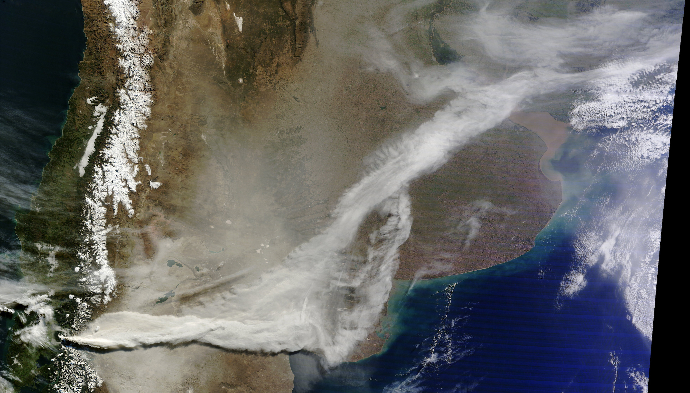
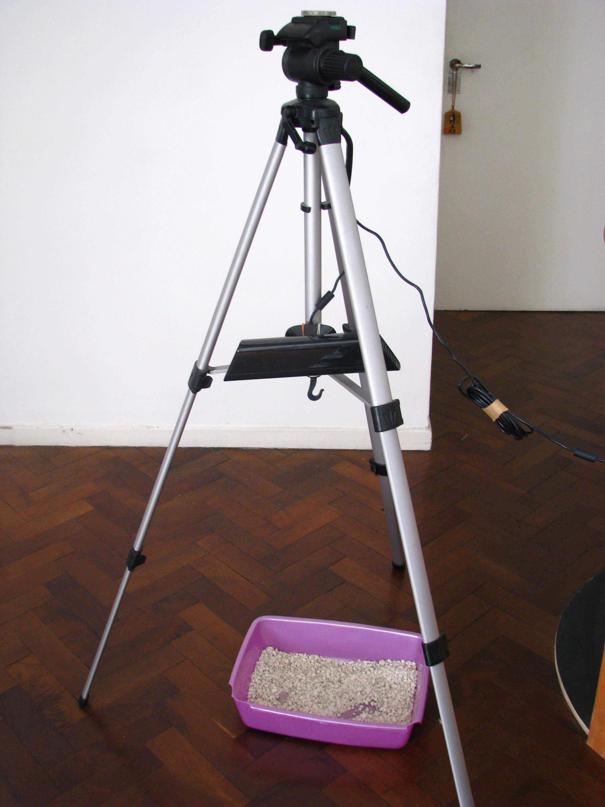
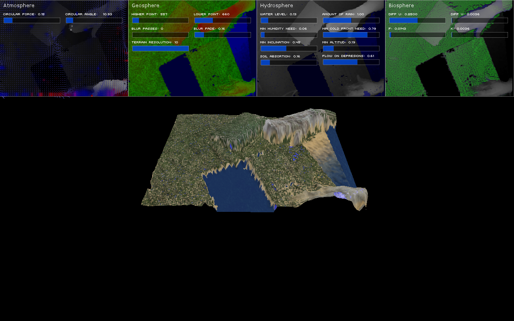

June 2011

Note:
2011 June 04, a vulcano named Puyehue makes eruptuion at the south of Chile.

--


--



Note:
Theys after, plume travels all the way to Buenos Aires. In it path's, brings destruction, disruption and unpredictable consecuences to landscape and the living forms that habite it.

Mean while, I was transitioning from my practice on clinical psichology & expressive art therapy to digital art.
I was working on an interactive peace about the Butterfly Effect, produce by human interaction with the enviroment. Simulating an ecosystem on a sanbox, that invites people to intervine it but makeing visible how unpredictable and destructive this interventions could be.

--



Note:
This was my first prototype. Rapidly I run out resources by the amount of pixel by pixel operations I need to make. The solution was to teach my self shaders.

--



Note:
They provide the computational power to simulate different layers in modules and combine them in an efficient and state of the art way.
On that there were not any system like that, neither enought information about shaders.
Comming from clinical psichology, was a challenge to teach my self how to use them.

--

<!-- .slide: data-background="#FFFFFF" -->


[**Efecto Mariposa** (Butterfly effect)](http://patriciogonzalezvivo.com/2011/efectomariposa/)

Note:
I end up incorporating the volcanic ashes to it. Beside been a perfect mapping surface I found it simbolically intune with the work. Those ashes, that cause so much disruption, bring an extra intangible meaning to the peace.
This works got a lot of recognition in Latin America. I was invited to File and other festivals to show it.
I will, is not easy to transport volcanic ashes by plane.

--

<!-- .slide: data-background="#FFFFFF" -->


Note:
I decide to open source source the modules I use for the simulation into an openFrameworks addons. So other artist don't have to struggle to learn this technology. People love it! It become one of the popular once.

--

January 2012

Note:
On January 2012 I made a trip to visit NYC. I send a email to Zach. How at that same time was having troubles compiling my addon.

--


Note:
We meet and we talk mostly about life. He toldme he resently got merry and his life was changing in this new fascinatings ways.
I told him, I was searching for a carrer change. I was wanting to close my private office and dedicate fulltime being an artist. He suggest applying to the Master on Design and Technology at Parsons The New School.
I did that that same night.

--


Note:
Because is a low level language is very powerfull... but it was a very minimal API. 
For example there is no random. So in order to make this patterns I use this functions...

---

<!-- .slide: data-background="#FFFFFF" -->
```glsl
float pseudo_random = fract(sin(time) * 43758.5453123);
```

Note:
It's a pseudo random function constructed with the fractional part of a Sine function multiply by a big number.

---

**~1700** stations  <!-- {_class="fragment"} -->
**x** **40** days  <!-- {_class="fragment"} -->
(**960** hs)  <!-- {_class="fragment"} -->
**=** **1,536,000** samples  <!-- {_class="fragment"} -->

Note:
I have been collecting NOAA METAR's for all US weather stations the last weeks.

Every day I have a raspberrypi fetching the last 24 cycles of 1700 stations that report around every hour.
The raspberry pi download the METAR text files from NOAA FTP server and parse it into JSON that store for each day.
Then with another script enconde all those JSON files for each day into a single image.

That's arround a millon an a half samples.

--

* temperature <!-- {_class="fragment"} -->
(RED) <!-- {_class="fragment"} -->

* wind speed <!-- {_class="fragment"} -->
(GREEN) <!-- {_class="fragment"} -->

* wind direction <!-- {_class="fragment"} --> 
(BLUE) <!-- {_class="fragment"} -->

Note:
For each record I'm storing the temperature, Wind speed and wind direction in the RED, GREEN and BLUE channels of a picture.

--


Note:
This is how the image looks

--

<!-- .slide: data-background="#A8B3B1" -->
<iframe class='fit' width="100%" height="100%" style='min-height: 600px; height: 100%;' data-src="http://tangrams.github.io/WeatherOverTime/"></iframe>

--

<canvas class='sandbox fit' data-fragment-url='shaders/datastream-texture.frag' data-textures='https://cdn.rawgit.com/tangrams/WeatherOverTime/gh-pages/data/data.png' width='800px' height='600px' ></canvas>

Temperature and Wind Data

--

<canvas class='sandbox fit' data-fragment-url='shaders/10print.frag' data-textures='https://cdn.rawgit.com/tangrams/WeatherOverTime/gh-pages/data/data.png' width='800px' height='600px' ></canvas>

10 Print (pseudo random)

--

<canvas class='sandbox fit' data-fragment-url='shaders/10print-wind_dir.frag' data-textures='https://cdn.rawgit.com/tangrams/WeatherOverTime/gh-pages/data/data.png' width='800px' height='600px' ></canvas>

10 Print (wind direction)

--

<canvas class='sandbox fit' data-fragment-url='shaders/10print-wind_speed.frag' data-textures='https://cdn.rawgit.com/tangrams/WeatherOverTime/gh-pages/data/data.png' width='800px' height='600px' ></canvas>

10 Print (wind speed)

--

<canvas class='sandbox fit' data-fragment-url='shaders/10print-wind_speed.frag' data-textures='https://cdn.rawgit.com/tangrams/WeatherOverTime/gh-pages/data/data.png' width='800px' height='600px' ></canvas>

10 Print (temperature)

--

<!-- .slide: data-background="#FFFFFF" -->
<canvas class='sandbox fit' data-fragment-url='shaders/iching-texture.frag' data-textures='https://cdn.rawgit.com/tangrams/WeatherOverTime/gh-pages/data/data.png' width='500px' height='500px' ></canvas> 

Wind I Ching 

---

<!-- .slide: data-background="#FFFFFF" -->
<canvas class='sandbox fit' data-fragment-url='shaders/iching-texture.frag' data-textures='https://cdn.rawgit.com/tangrams/WeatherOverTime/gh-pages/data/data.png' width='300px' height='300px' ></canvas>

## Thank you

[patricio.io](http://patricio.io) | [@patriciogv](https://twitter.com/patriciogv)
