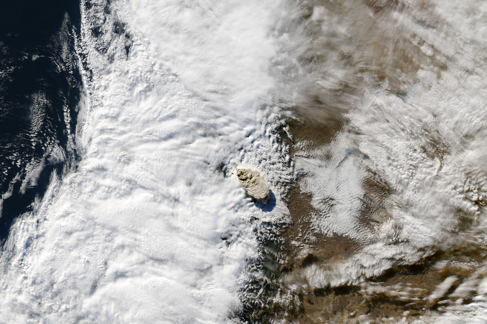
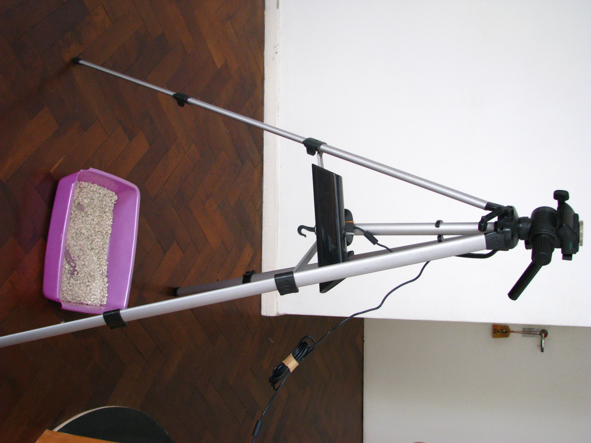

June 2011

Note:
2011 June 04, a Chilean Puyehue volcano makes eruptuion 

--

--

Note:
The plume arrive to buenos aires caisng all types of unpredicted consecuences.
I start working on an interactive peace about the ButterflyEffect at global scale. Esentially a sandbox wher to simulate an entiere ecosystem.
This is the first prototype

--

