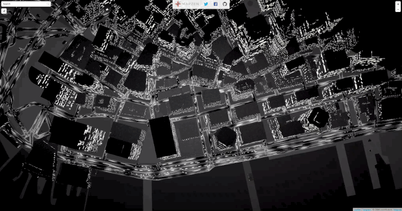

<!-- .slide: data-background="#000000" -->
## What are the chances?

---

"Our Science is based upon the principle of causality, 

and causality is considered to be an axiomatic truth."

<p> ... </p>
*Carl Gustav Jung*

---

<!-- .slide: data-background="#000000" -->
DEC 2009

Note:
While I was trying to make my own website in Flash for my practice as a ... therapist. 
Googling things around to find my way through Flash this happens...

--


Note:
Which leaveme to

--


Note:
Which eventually leaveme to

--


Note:
Daniel's Shiffman book was a revelation to me.
I was out of my mind... I always been a nerd that likes computers and I have route my carrer as a clinical therapist to incorporate some art on it.
I was painting... this two universe seams irreconciable... but now... now I was hable to do both!

I start searching for this hybrid artist. I send them emails to all of them, trying to see If I can find a local community to be part of

--


Note:
I only got one reply from Chiss Sugrue

--

<!-- .slide: data-background="#000000" -->


Note:
At the end of 2010 I was showing this instalation to draw colective mandalas at Interactivos Telefonica.

--

"If we leave things to nature, we see a very different picture:

every process is partially or totally interfered with chance, 

so much so that under natural circumstances a course of events 

absolutely confoming to specific laws is almost an exception."

<p> ... </p>

*Carl Gustav Jung*

---

<!-- .slide: data-background="#000000" -->
JUN 2011

Note:
2011 June 04, starting an art recidency in centro Cultural Espanol on Buenos Aires....

--

<!-- .slide: data-background="#000000" -->


Note:
A vulcano named Puyehue makes eruptuion at the south of Chile.

--

<!-- .slide: data-background="#161616" -->
<iframe class='fit' width='100%' height='100%' style='min-height: 1000px;' data-src='tangram.html?style=puyehue#6.81187/-37.148/-63.976'></iframe>

Note:
Theys after, plume travels all the way to Buenos Aires. In it path's, brings destruction, disruption and unpredictable consecuences to landscape and the living forms that habite it.

--

<!-- .slide: data-background="#000000" -->
<!--  -->

<iframe src="https://player.vimeo.com/video/31940579" class='fit' width='100%' height='1000px' frameborder="0" webkitallowfullscreen mozallowfullscreen allowfullscreen></iframe>

Note:
Using the ashes of this plum I made a interactive simulation of an ecosystem, that invites people to intervine it but makeing visible how unpredictable and destructive this interventions could be. I call it Butterfly Effect.

They provide the computational power to simulate different layers in modules and combine them in an efficient and state of the art way.
On that there were not any system like that, neither enought information about shaders.
Comming from clinical psichology, was a challenge to teach my self how to use them.

--

<!-- .slide: data-background="#000000" -->


**Efecto Mariposa** (Butterfly effect)

Note:
The volcanic ashes end up been a perfect mapping surface beside significative simbolically. 
Those ashes, that cause so much disruption, bring an extra intangible meaning to the peace.
This works got a lot of recognition in Latin America. I was invited to File and other festivals to show it.
I will, is not easy to transport volcanic ashes by plane.

I never recive to much credit internationally... even after the fact that some eyars later lot of similar project start apearing all around the world.
I was getting a litle bitter about it... so I decide to openSource the differnt modules in form of a openFrameworks addon.

--

<!-- .slide: data-background="#000000" -->
<iframe src="https://player.vimeo.com/video/30684308?loop=1&title=0&byline=0&portrait=0" width="640" height="478" frameborder="0" webkitallowfullscreen mozallowfullscreen allowfullscreen></iframe>
<iframe src="https://player.vimeo.com/video/29896245?loop=1&title=0&byline=0&portrait=0" width="640" height="480" frameborder="0" webkitallowfullscreen mozallowfullscreen allowfullscreen></iframe>
<p> + </p>
<iframe src="https://player.vimeo.com/video/29894099?loop=1&title=0&byline=0&portrait=0" width="640" height="480" frameborder="0" webkitallowfullscreen mozallowfullscreen allowfullscreen></iframe>
<iframe src="https://player.vimeo.com/video/29887776?loop=1&title=0&byline=0&portrait=0" width="640" height="480" frameborder="0" webkitallowfullscreen mozallowfullscreen allowfullscreen></iframe>

--

"... there is something to be said for the immense importance of chance.

An incalculable amount of human effort is directed to combating 

and restricting the nuisance or danger represented by chance."

<p> ... </p>

*Carl Gustav Jung*

Note:
There is something to said about opensourcing something that you have been working intensly for a year. 
It was some adrenaline, but at the same time you feel vulnerable and expose.

--


Note:
Hopefully when well.
People love it.

---

<!-- .slide: data-background="#000000" -->
JAN 2012

Note:
On January 2012

--

<!-- .slide: data-background="#000000" -->
Map of BUE and NYC pointing to Zack L trying to compile my OF addon

Note:
mean while in NYC Zack L was trying to run that same OF addon
We plan to meet If I go to NYC.
So that I did.

--

<!-- .slide: data-background="#000000" -->


Note:
and we meet, we talk mostly about life. He toldme about his recent merragie with Momo. And howhis life was changing in this new fascinatings ways.
I told him, about me wanting to change carrer. How I want to leave my patience and dedicate fulltime as an artis.

He suggest applying to the Master on Design and Technology at Parsons The New School.
And I did...
that that same night!

--

<!-- .slide: data-background="#000000" -->
MAP of patricio moving to NY

Note:
3 Mounth later I got a big envelope with an offer of a full tuition to go to Parsons.
I sell everything and told my patients I have been living two lifes. I had a crush with digital art and new media. 
I came to NYC

--

<!-- .slide: data-background="#000000" -->


--

<!-- .slide: data-background="#000000" -->
Meanwhile in the other coast...

--

<!-- .slide: data-background="#000000" -->


Note:
Jen Lowe: was initiating the process to move to New York to work on the Spatial Information Design Lab at Columbia University... and open a school with Zack L

--

<!-- .slide: data-background="#000000" -->
MAP of Jen's trip from SF to NYC

---

<!-- .slide: data-background="#000000" -->
MAY 2013

--

<!-- .slide: data-background="#000000" -->
  
  

Visual Systems for CLOUDS Documentary

Note:
While I was working on the visual system on CLOUDS.
Zach anounce the SFPC. While I was his students he talk about the idea of the school a lot. So I followed the four founders (Jen, Zack, Amit and Tewon).
Through a random twitter interaction we start talking and agree on going for a coffee.

--

<!-- .slide: data-background="#000000" -->
interactive POINT CLOUD of the restaurant coorner where we meet

Note:
I felt in love completely

--

<!-- .slide: data-background="#000000" -->


Note:
The finny side of the story is that Zack got me a Ricardo some volunteer tickets, to come in 2013.
And she was speaking that year. So suddently eyeo become like a honey moon vacations.
In my memory Miniapolis is more romantic that Paris and veneces... together.
Is the american city of love.

Look that face of happines :)

So...

--

<!-- .slide: data-background="#000000" -->


Note:
... one month later we move together.
And we start thinking about marrige a couple of weeks later.

... and babies at the end of the year.

---

<!-- .slide: data-background="#000000" -->
March 2014

Note:
2014 an year of closeres and begginings... 
Wrapping up my thesis for Parsons...

--


[**Skyline I**](http://patriciogonzalezvivo.com/2014/skylines/skylines.php?v=01)

Note:
series of projects is about awareness. It is about the tools and techniques we use to see the world around us.

This is a drawing machine that slowly reveals an image of the world viewed through the tireless eye of technology. It constantly adds traces of material, demonstrating that the drive for immediacy is not inherent in technology.

--


[**Skyline II**](http://patriciogonzalezvivo.com/2014/skylines/skylines.php?v=02)

Note:
This is a machine that prints the large-scale transitions of the horizon on a path from the city to the mountains. While Skyline #01 sees through the flow of the time, Skyline #02 expands our perception of space.

--

<!-- .slide: data-background="#000000" -->


Note:
For this project I was scrapping google street view data to construct this continues horizon.
You can see how using google's routing service I choose a path, to then make different request to the GoogleStreetView API

--

<!-- .slide: data-background="#000000" -->


Note:
I wasn't completely happy on how this look so I was trying some other things.
I was trying to put this "bubles" togther and put a camera go from one to the other... 
but was basically going trough this wall meshes... kind of disaster. Hulking out the virtual streets

--

<!-- .slide: data-background="#000000" -->


Note:
Then I found this... there was some low definition depth data that could be accesss throught the API

--

<!-- .slide: data-background="#000000" -->


Note:
And now we have some Z. At this point I was: "well, I worked on CLOUDS, I can only use the vertex points and get away with it".

--

<!-- .slide: data-background="#000000" -->


Note:
So I was trying this things before going to bed... adding up this spheres of points... not really sure What It and Jen pass by and she said to me... "That's cool you should tweet about it"

--

<!-- .slide: data-background="#000000" -->


Note:
And I did

--

<!-- .slide: data-background="#000000" -->
<!-- <iframe src="https://player.vimeo.com/video/101107332?title=0&byline=0&portrait=0" width="100%" height="1000px" frameborder="0" webkitallowfullscreen mozallowfullscreen allowfullscreen></iframe> -->

<iframe src="https://player.vimeo.com/video/89982874?title=0&byline=0&portrait=0" width="100%" height="1000px" frameborder="0" webkitallowfullscreen mozallowfullscreen allowfullscreen></iframe>

Note:
...
People went kind of crazy, everybody thought was Lidar data... is not. The process actually is very slow

--


Note:
I start pullishing

--


Note:
until start making sense for me.

--


Note:
in lot of things it was like the begining of photography.

--


Note:
I put my camera some where... and then set a robot to retrive this points of information from googles evil servers.

--


Note:
I had to wait this digital landscapes reviel. develop over time.

In that time, I didn't knew it... but I'm preatty sure this got me my actual job 

--


Note:
... at Mapzen. I was showing this work to my actual boss. And He was very excited to bring this kind of exploratory creative work to the mapping world. 
I understood my position as a sort of inhouse R&D possition.

--


Note:
On august 2014, I join the stellar team of Mapzen.
I had to say that is a priviledge of a life time to work with such an amazing line up of profesionals.

--

 

[Experiments on **3D Labels** (C++)](https://vimeo.com/107190391)

Note:
this 3D labels and way finding prototype

--

   

[Experiment on LIDAR + SfM + OpenStreetMap (Python/C++)](https://mapzen.com/blog/point-clouds)

Note:
or this experiment about mixing LIDAR data with Structure from Motion point clouds from images with openStreetMap data.

--

 

 

[Tangram styles (WebGL)](patriciogonzalezvivo.github.io/tangram-sandbox/)

Note:
And then doing cross plaform implementations on Tangram our 2D/3D map engine. At the same time I push the limites of it with doing some maps.

--

 

 

<!-- .slide: data-background="#000000" -->
*Tangram styles (WebGL)*

--

 

 

<!-- .slide: data-background="#000000" -->
*Tangram styles (WebGL)*

--

<!-- .slide: data-background="#020303" -->


  

*Line of Sight*

--


*Terrarium experiments*

--


*Terrarium experiments*

Note:
Having a stable corporate job, was new to me so It didn't take longer to wanting to have my own personal work. 
Something I could do in my free time.

---

JAN 2015

--


Note:
I remember how hard was to learn shaders at the begining and how helpfull have been to know about them.
Something to bring back to the community of developers, art and design, that give me so much.
I decide to start a book that helps artist to learn and use Shaders.

--


--


--


--


Note:
The book had open oportunities for new collaborations

--

MAP of all the people that is collaborating overt the world on this book

Note:
Beside Jen Lowe that had done all the editing of the book
Other people join in the project, voluntering their time and energy.

- Kenichi Yoneda @kyindinfo
- Sawako
- Tong Li 
- Yi Zhang 
- Jae Hyun Yoo 
- Nicolas Barradeau @nicoptere
- Karim Naaji @karimnaaji
- Nahuel Coppero (Necsoft) 

So far we hace translate the book of shaders to Japanise, Korean, Spanish, French and it's an on going italian translation

--


**[o]** openFrame.io

--


**Ishac Bertran**

@ishacbertran

--


**Jonathan Wohl**

@jonwohl

--


Note:

This collaboration start when I run with Ishac in the street. And he toldme he was working (on what in that moment) sound like a OpenSource Electric object that runs on a RaspberryPi.
As a lover of RPis and Shaders I have been wanting to do that for a while... in fact I start this tool render shaders on OSX, Linux and RPI.

I started as a tool for my self to live code shaders.

Which once I learn JS evolve to this editor 

--

<!-- .slide: data-background="#272822" -->
<iframe class='fit' width='100%' height='100%' style='min-height: 1000px;' data-src='http://editor.thebookofshaders.com/'></iframe>

Note:
That's the one I use for the book.

Any way... He told me that and I open the lapdoc for my RPI and show some shaders running... and said: we can show artwork in form of shaders!


I really like shaders. I like the size and their restrictions and power.
They are like a HAIKUs. You have no library to reference... and you just can generate images.

--

<!-- .slide: data-background="#272822" -->
<iframe class='fit' width='100%' height='100%' style='min-height: 1000px;' data-src='http://editor.thebookofshaders.com/?log=160306213426'></iframe>

Note:
So when you want to share a shader to an openFrame you only have to click export and [o]

--

<!-- .slide: data-background="#000000" -->
<iframe class='fit' width='100%' height='100%' style='min-height: 1000px;' data-src='http://player.thebookofshaders.com/?log=160301005406'></iframe> 

Note:
So I start writing this shaders for openFrame.

--

<!-- .slide: data-background="#000000" -->
<iframe class='fit' width='100%' height='100%' style='min-height: 1000px;' data-src='http://player.thebookofshaders.com/?log=160307213819'></iframe> 

Note:
I love having a frame for them. My idea of shaders have been changing...

--

<!-- .slide: data-background="#000000" -->
<iframe class='fit' width='100%' height='100%' style='min-height: 1000px;' data-src='http://player.thebookofshaders.com/?log=160304203331'></iframe> 

Note:
Again I like the restrictions... not just in the hardware but also the posibilities... helps me to concetrate on simple things.

--

<!-- .slide: data-background="#000000" -->
<iframe class='fit' width='100%' height='100%' style='min-height: 1000px;' data-src='http://player.thebookofshaders.com/?log=160304202332'></iframe> 

Note:
simple ideas

--

<!-- .slide: data-background="#000000" -->
<iframe class='fit' width='100%' height='100%' style='min-height: 1000px;' data-src='http://player.thebookofshaders.com/?log=160313030533'></iframe> 

ADD A GALLERY
ADD MORE AND BETTER SHADERS

---

### Workflow

--


Note:
The book also blend in my work.
I start researching a theme or an artist
Like producing pseudo random in GLSL and Ryoji Ikeda

--

<iframe class='fit' width='100%' height='800px' data-src='http://thebookofshaders.com/10'></iframe>

Note:
Then start writing about it

--

<canvas class='sandbox fit' data-fragment-url='shaders/ikeda-00.frag' width='900px' height='400px' ></canvas>

TODO: GLSLGALLERY HERE

test pattern

Note:
Making small examples

--

<canvas class='sandbox fit' data-fragment-url='shaders/ikeda-03.frag' width='900px' height='400px' ></canvas>

datastream

--

<canvas class='sandbox fit' data-fragment-url='shaders/ikeda-02.frag' width='900px' height='400px' ></canvas>

--

<canvas class='sandbox fit' data-fragment-url='shaders/ikeda-04.frag' width='900px' height='400px' ></canvas>

--

<!-- .slide: data-background="#000000" -->
<canvas class='sandbox fit' data-fragment-url='shaders/ikeda-digits.frag' width='900px' height='400px' ></canvas>

--

<!-- .slide: data-background="#000000" -->
<canvas class='sandbox fit' data-fragment-url='shaders/ikeda-numered-grid.frag' width='900px' height='400px' ></canvas>

Note:

And at one time I found my self with enought content to start composing this sketches.

--

<!-- .slide: data-background="#000000" -->
<iframe class='fit' width='100%' height='100%' style='min-height: 1000px;' data-src='tangram.html?style=randomCity&animate=true#15/40.7076/-74.0146'></iframe> 

Note:
...
Also the oposite have been true

---


<!-- .slide: data-background="#020303" -->
<iframe class='fit' width="100%" height="100%" style='min-height: 1000px;' data-src="http://patriciogonzalezvivo.github.io/LineOfSight/"></iframe>

*LineOfSight*

Note:
For Line of Sight I have this problem of how to update the position of 1500 moving targets wit precession.

--


Note:
The solution was to encode all the future positions of each satellite in the next following hour into a image.
Each pixel is encode a big number with pressition enought to display it in the exact locating it will be.
The first part of the screen are for the longitudes while the second is latitud.
Each satelitte just need to read in the right row at the right offset on time to know their exact location.

--

<!-- .slide: data-background="#2E2A27" -->


Note:
Imagine that image as a "played piano roll". Each satellite, like a each key on the piano will read one line of the image. But instead of the binarry format of the roll... will look for a position incoded in color. 

--


--

# 10%
<!-- .slide: data-background="#17141B" -->

Note:
This is not only 10% feawer data to pass, but only require one call to the GL API instead of one per each satellite by frame (close to over 36.000)

---


Note:
For this other project I start collection US NOAA's Weather station for the last 7 weeks with my RaspberryPi

--

**~1700** stations  <!-- {_class="fragment"} -->
**x** **40** days  <!-- {_class="fragment"} -->
(**960** hs)  <!-- {_class="fragment"} -->
**=** **1,536,000** samples  <!-- {_class="fragment"} -->

Note:
Every day I have a raspberrypi fetching the last 24 cycles of 1700 stations that report around every hour.
The raspberry pi download the METAR text files from NOAA FTP server and parse it into JSON that store for each day.
Then with another script enconde all those JSON files for each day into a single image.

That's arround a millon an a half samples.

--

* temperature <!-- {_class="fragment"} -->
(RED) <!-- {_class="fragment"} -->

* wind speed <!-- {_class="fragment"} -->
(GREEN) <!-- {_class="fragment"} -->

* wind direction <!-- {_class="fragment"} --> 
(BLUE) <!-- {_class="fragment"} -->

Note:
For each record I'm storing the temperature, Wind speed and wind direction in the RED, GREEN and BLUE channels of a picture.

--


Note:
This is how the image looks

--

<!-- .slide: data-background="#14131A" -->
<iframe class='fit' width="100%" height="100%" style='min-height: 600px; height: 100%;' data-src="http://tangrams.github.io/WeatherOverTime/"></iframe>

[github.com/**tangrams**/***WeatherOverTime***](https://github.com/tangrams/WeatherOverTime)

Note:
The interesting thing about this project was the data in it self.

--

<canvas class='sandbox fit' data-fragment-url='shaders/datastream-texture.frag' data-textures='shaders/data.png' width='900px' height='400px' ></canvas>

Temperature and Wind Data

Note:
This is that image I show before but displayed with a shader... is very random.

--

```glsl
float pseudo_random = fract(sin(time) * 43758.5453123);
```

Note:
For those that use random in shaders this is how you make pseudo random

--

<!-- .slide: data-background="#000000" -->
<canvas class='sandbox fit' data-fragment-url='shaders/10print.frag' data-textures='shaders/data.png' width='900px' height='400px' ></canvas>

10 Print (pseudo random)

Note:
And looks like this. What if instead of using this pseudo random I use the weather data?

--

<!-- .slide: data-background="#000000" -->
<canvas class='sandbox fit' data-fragment-url='shaders/10print-wind_dir.frag' data-textures='shaders/data.png' width='900px' height='400px' ></canvas>

10 Print (wind direction)

Note:
This is a maze constructed with wind direction 

--

<!-- .slide: data-background="#000000" -->
<canvas class='sandbox fit' data-fragment-url='shaders/10print-wind_speed.frag' data-textures='shaders/data.png' width='900px' height='400px' ></canvas>

10 Print (wind speed)

Note:
This is a maze constructed with wind speed 

--

<!-- .slide: data-background="#000000" -->
<canvas class='sandbox fit' data-fragment-url='shaders/10print-temp.frag' data-textures='shaders/data.png' width='900px' height='400px' ></canvas>

10 Print (temperature)

Note:
This is a maze constructed with temperature.
Seeing this I can't avoid thinking back to the begining of the talk those fraces from Carl Gustave Jung about chance.

He wrote that for the Foreword of the book of transformations. 

--


Note:
Which is basically an ancient oracle 

--


Note:

This binary elements (bar or two dashes). Get's combined into 64 hexagrams

--

<!-- .slide: data-background="#FFFFFF" -->
<canvas class='sandbox fit' data-fragment-url='shaders/iching.frag' data-textures='shaders/data.png' width='1000px' height='500px' ></canvas> 

--

<!-- .slide: data-background="#FFFFFF" -->
<canvas class='sandbox fit' data-fragment-url='shaders/iching-texture.frag' data-textures='shaders/data.png' width='500px' height='500px' ></canvas> 

Wind I Ching 

Note:
This is my Iching shader that doesn't use a pseudo random... but real wind data.

So next time the wind changes

---

<!-- .slide: data-background="#161616" -->
<iframe class='fit' width='100%' height='100%' style='min-height: 1000px;' data-src='tangram.html?style=puyehue#6.81187/-37.148/-63.976'></iframe>

Note:
and clouds comes to a city.
not necesary mean bad news. 

---


Note:
We can choosose see the bigger picture... the texture we are part of.
Not just the cause and consecuence.

--

MAP of all the things display before

Note:
Imagine the adventures that could come.
Together with the end 

--


Note:
and begining of things. 

---


## Thank you

[patricio.io](http://patricio.io) | [@patriciogv](https://twitter.com/patriciogv)

--

[**patriciogonzalezvivo**.github.io/**eyeo16**](http://patriciogonzalezvivo.github.io/eyeo16/)

Note:
here you can find this presentation.
