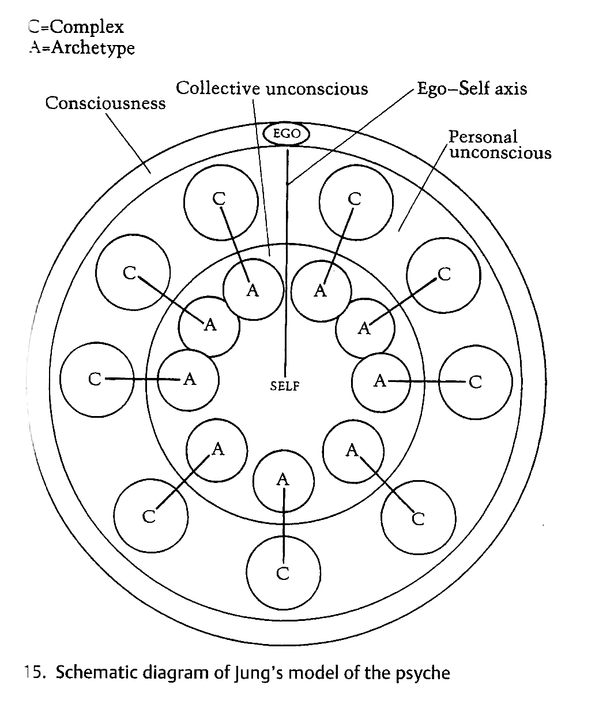
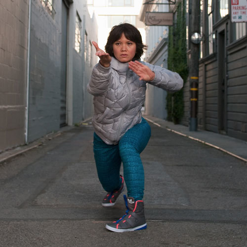

<!-- .slide: data-background="#000000" -->
# What are the chances?

---

DEC 2009

Note:
In dicember 2009, I was working on the annoying/imposible process of making your own website.
In my case this website

--

<!-- .slide: data-background="#91AC99" -->
<iframe class='fit' width='100%' height='600px' data-src='https://web.archive.org/web/20100620130219/http://www.arteparasanarte.com.ar/'></iframe>

Note:
It's important to say in that time I was working as Clinical Psychologist and Expressive art Therapist.
Esentially doing a lot of things that looks this other thing:

--

<!--  -->

Note:
Any way...
I was teaching my self flash to make my own website for my practice as an art therapist. 
Googling around I search for “processing XML”

--

Note:
Which lead me to processing documentation (made by Scott Murray??)

--

Note:
I was FASCINATED. 

This people were combining arts with computer code.
In my world at that moment I was a misfit.

Beside the fact that I always have been a nerd that like computers. Buenos Aires, is together with Paris and Upper West Side in Manhattan, one of the last places where people do (and like) Psychoanalyst.

So while everybody in school was into this guy:

--

Note:
was a fan of this other guy.

--

Note:
… his archenemy, Carl Gustave Jung.

(he actually looks like my grand father)

Like most archenemies, they use to be friends. Jung was the favorite disciple. Freud name him his sucesor and put him in charge of the International Psychoanalytical Association.

--

Note:
They disagree on the origin of libido and in the scope of unconscious. Freud, father of this ideas, thought the libido was just sexual, and the unconscious made of personal memories.

Jung disagree that the libido was only a sexual. He also believed that deeper than the personal unconscious was a bast collective ocean of shared psychological content. Not just instincts but a whole set of psychological structures, he later call archetypes. They manifest in mythological themes, images, patterns visible along generations and around the world.

--

Note:
For him the personal psique emerge from this collective sea

--

<iframe class='fit' width='100%' height='100%' style='min-height: 1000px;' data-src='http://localhost:8000/tangram.html?style=emerge#15.3023/-22.9476/-43.1791'></iframe>

--

Note:
I was in love with this ideas, to the point that I did a post degree in Jung and the use of art as a way to pull content from this deep ocean. To amplify meaning thought the use of different expressive languages.

--

Note:
Is funny because each different language have the ability to think and said things in different ways. 

--

Note:
Movement for example, it fluctuates over time... was this ability to transform things.... you enter into an activity with an emotion and thought dance you can move it, transform it into something else....

--

Note:
Painting is more like a sedimental process... you bring something and you put it on paper... then you add more and more stuff... an image slowly appears over time.

--

Note:
So I was there looking to all this hybrid artist using code as a language. 
I was intrigue  about what the uses of this as an expressive language. What could be said with technology that could be said in another way.

I send emails to all the artist could found. 
Only one reply

--

Note:
... Chiss Sugrue.
So I did...
I got in touch w Diego
How suggest to apply for interactivos telefonica.
And again... I did.

--

*Fundacion Telefonica* - **INTERACTIVOS** 2010

Note:
Here we are in interactivos 2010. I made long lasting friends there, like Tomas Rawski.

Most beautiful things are un expected

Jung have a interesting concept call **synchronicity**
On his work he notice that In his diaries, what later become the red book….

---

--

<!-- .slide: data-background="#000000" -->

Note:
… he wrote a series of apocalyptic dreams he had. He was concern of his own mental health. But then he start hearing similar dreams by some of his patients.  He was conflicted with the fact that maybe he was some how influencing them.

--

<!-- .slide: data-background="#000000" -->

Note:
When the first world war start was clear for him that actually everybody was have been feeling something coming... In the same way animals feels natural disasters before they happen... There was something in there air that was pict subconsciously by him and his patient..

Because this events didn't directly respond to a cause and effect relation. He call them acausal events. And he thought they could be explain because  of the collective incouncius

In June 2011  (five years ago)...
without any notice....
and after 50 years of lying dormant a volcano at the south of Chille call Puyehue made eruption.

--

<!-- .slide: data-background="#000000" -->

JUN 2011

--

<!-- .slide: data-background="#000000" -->

Note:
This eruption ejected around one hundred million tons of ash, sand and pumice. 

--

<!-- .slide: data-background="#000000" -->

Note:
This eruption ejected around one hundred million tons of ash, sand and pumice. 

--

<!-- .slide: data-background="#000000" -->

Note:
Days after, the plume travels all the way to Buenos Aires. 

--

<!-- .slide: data-background="#161616" -->
<iframe class='fit' width='100%' height='100%' style='min-height: 1000px;' data-src='tangram.html?style=puyehue#6.81187/-37.148/-63.976'></iframe>

Note:
In it path..

--

<!-- .slide: data-background="#000000" -->

 <!-- {_class="fragment"} -->
 <!-- {_class="fragment"} -->
 <!-- {_class="fragment"} -->

Note:
the ashes bring destruction.
- all flights cancel across the southern half of the continent
- Nilahue River went up to 113° and killed around 4.5 million fishes
- heart attacks and got throat cancer on the livestock
- fluoride intoxication in sheep, cattle and horses
- bring five years of drought on Chubut and Rio Negro
This incredible force of nature brings a lot of destructions on it's way

--

<!-- .slide: data-background="#000000" -->
<iframe src="https://player.vimeo.com/video/31940579" class='fit' width='100%' height='1000px' frameborder="0" webkitallowfullscreen mozallowfullscreen allowfullscreen></iframe>

Note:
During the volcano I was working on a project that use kinect camera to do a projection mapping of a ecosystem simulation over a sandbox. My goal was to invite user to interact with it, and by that bring destruction that will take some time to heal and go back to homeostasis. The scale of the volcano eruption had a great influence in this peace. I replace the sand by volcanic ashes, and work hard on it to make the algorithms as complex and realistic as I could. For that I had to learn shaders. It wasn't easy, but at the end was very satisfying to see that the people interacting with it. I like to think that something of what we experience that year could be re experienced in this particular way. In order to think it in a different and healing way.

--

<!-- .slide: data-background="#000000" -->

**Efecto Mariposa** (Butterfly effect)

Note:
There is something that give us pleasure of having the illusion of controlling chaos and chance. Even when we see that the repercussions of our interactions scape our perception of understanding... we find confort in the illusion of control.

--

<!-- .slide: data-background="#000000" -->
<iframe src="https://player.vimeo.com/video/30684308?loop=1&title=0&byline=0&portrait=0" width="640" height="478" frameborder="0" webkitallowfullscreen mozallowfullscreen allowfullscreen></iframe>
<iframe src="https://player.vimeo.com/video/29896245?loop=1&title=0&byline=0&portrait=0" width="640" height="480" frameborder="0" webkitallowfullscreen mozallowfullscreen allowfullscreen></iframe>

 + 

<iframe src="https://player.vimeo.com/video/29894099?loop=1&title=0&byline=0&portrait=0" width="640" height="480" frameborder="0" webkitallowfullscreen mozallowfullscreen allowfullscreen></iframe>
<iframe src="https://player.vimeo.com/video/29887776?loop=1&title=0&byline=0&portrait=0" width="640" height="480" frameborder="0" webkitallowfullscreen mozallowfullscreen allowfullscreen></iframe>

Note:
Efecto Mariposa was made using openFrameworks.
After this work was expose I start thinking on how to give back. On what could be the best way to open source this work. As a tool. 
Open Source it into an OF addon: ofFX

--

Note:
thanks to that I meet Zack Liberman...

--

<!-- .slide: data-background="#000000" -->

Note: he was the one that suggest applying to the master in design and technology at parsons... which I did... 

--

<!-- .slide: data-background="#161616" -->
<iframe class='fit' width='100%' height='100%' style='min-height: 1000px;' data-src='tangram.html?style=bue-nyc#3.8/5.83/-62.89'></iframe>

Note:
and I got to come to NYC.

--

<!-- .slide: data-background="#000000" -->
  
  

Visual Systems for CLOUDS Documentary

Note:
While I was working on the visual system on CLOUDS w James and Jonathan...

--

<!-- .slide: data-background="#000000" -->
<iframe class='fit' src="https://www.google.com/maps/embed?pb=!1m0!3m2!1sen!2sus!4v1463075256574!6m8!1m7!1sp1dCLliwGRUAAAQZDaBD0w!2m2!1d40.72371832370289!2d-73.95171632224185!3f44.320821265143294!4f-15.56789776591117!5f0.7820865974627469" width="100%" height="1000" frameborder="0" style="border:0" allowfullscreen></iframe>

Note:
I meet Jen in this coorner on Green point.

--

<!-- .slide: data-background="#161616" -->
<iframe class='fit' width='100%' height='100%' style='min-height: 1000px;' data-src='tangram.html?style=sfc-nyc#5.47188/39.742/-99.548'></iframe>

Note:
She also just arrive to NYC move by her own series of random events.

Something funny is that two weeks after we meet. She was speaking that year here at EYEO. And I got a last minute ticket.

--

<!-- .slide: data-background="#000000" -->

 <!-- {_class="fragment"} -->

Note:
So suddently eyeo become like a honey moon vacations.
In my memory Miniapolis is more romantic that Paris and veneces... together.
Is the american city of love.

--

<!-- .slide: data-background="#000000" -->

---

MAR 2014

Note:
But is not just that randoms happens. Is about been open (and probably harder, staying open) to dance with it. 

While working on my Thesis

--

[**Skyline II**](http://patriciogonzalezvivo.com/2014/skylines/skylines.php?v=02)

Note:
I was working on a series of projects is about awareness and the tools we use to see the world around us.
This is a machine that prints the large-scale transitions of the horizon on a path from the city to the mountains. 

--

<!-- .slide: data-background="#000000" -->

Note:
For this project I was scrapping google street view data to construct this continues horizon.
You can see how using google's routing service I choose a path, to then make different request to the GoogleStreetView API

--

<!-- .slide: data-background="#000000" -->

Note:
I wasn't completely happy on how this look so I was trying some other things.
I was trying to put this "bubles" togther and put a camera go from one to the other... 
but was basically going trough this wall meshes... kind of disaster. Hulking out the virtual streets

--

<!-- .slide: data-background="#000000" -->

Note:
Then I found this... there was some low definition depth data that could be accesss throught the API

--

<!-- .slide: data-background="#000000" -->

Note:
And now we have some Z. At this point I was: "well, I worked on CLOUDS, I can only use the vertex points and get away with it".

--

<!-- .slide: data-background="#000000" -->

--

<!-- .slide: data-background="#000000" -->

--

<!-- .slide: data-background="#000000" -->
<iframe class='fit' width='100%' height='100%' style='min-height: 1400px; position: absolute; top: 0px; right: 0px;' data-src='http://patriciogonzalezvivo.com/2014/pointcloudcity/wash-sq/'></iframe>

--

Note:
I start pullishing

--

Note:
until start making sense for me.

--

Note:
in lot of things it was like the begining of photography.

--

Note:
I put my camera some where... and then set a robot to retrive this points of information from googles evil servers.

--

<iframe class='fit' width='100%' height='100%' style='min-height: 1400px; position: absolute; top: 0px; right: 0px;' data-src='http://patriciogonzalezvivo.com/2014/skylines/queensboro/'></iframe>

Note:
I had to wait this digital landscapes reviel. develop over time.

--

Note:
Preparing for this talk I want to do some new point clouds... but I discovery that google change their API... so this point clouds are somehow limited editions

---

Note:
Since AUG 2014 I had the inmense priviledge of start working for Mapzen.

--

Note:
Mapzen was a stellar line up of truly incredible and amazing people.
Working with this falks is a fantastic priviledge.

--

 

[Experiments on **3D Labels** (C++)](https://vimeo.com/107190391)

Note:
working there I have been hable to do all sort 

--

   

[Experiment on LIDAR + SfM + OpenStreetMap (Python/C++)](https://mapzen.com/blog/point-clouds)

Note:
of exploratory projects

--

 

 

[Tangram styles (WebGL)](patriciogonzalezvivo.github.io/tangram-sandbox/)

Note:
pushing the limits

--

<!-- .slide: data-background="#000000" -->

 

 

*Tangram styles*

Note:
of what digital cartography can look

--

<!-- .slide: data-background="#000000" -->
<iframe class='fit' width='100%' height='100%' style='min-height: 1000px;' data-src='tangram.html?style=randomCity&animate=true#15/40.7076/-74.0146'></iframe>

*RandomCity*

[* Inspired on Ryoji Ikeda work](http://www.ryojiikeda.com/)

Note:
today

--

<!-- .slide: data-background="#020303" -->

  

*Line of Sight*

Note:
[I think you can tie Mapzen in with openness + chance == interesting things; make the point that Mapzen is working in the open; share things *other* ppl have

One of the fantastic things about my work is that completely in the open.

--

**Geraldine** Sarmiento (@sensescape)

Note:
So beside working with the incrediblle 
Geraldine Sarmiento

--

**Weili** Shi (@shiweili)

Note:
we make tools for others to be creative. Like Weili Shi.

---

Note:
I start coding with this book of Daniel Shiffman.
This book so empowering to me. Was **gateway** to a lot of posibilities

--

Note:
that's why, as a side and long term project, I start writing a book to help others to start with shaders.
Back in the days of Efecto Mariposa, was very hard to start learning what was consider this dark art of GLSL Shaders.

--

Note:
Together with the writing cames ideas to make it more didactic

--

Note:
For example this embebed code editor you see here

--

<iframe class='fit' width='100%' height='1000px' data-src='http://thebookofshaders.com/05'></iframe>

Note:
or this other GLSL graph plotter 

This openSource project also open new chances of working with others from different parts of the world
This is a map of all the people that had collaborate so far.

--

<iframe class='fit' width='100%' height='100%' style='min-height: 1000px;' data-src='tangram.html?style=collaborators#3/20/10'></iframe>

Note:
I want to thanks specially to the translators

--

- **Kenichi** Yoneda (@kyindinfo)
- **Sawako** (@sawakohome)
- **Tong** Li 
- **Yi** Zhang 
- **Jae** Hyun Yoo 
- **Nicolas** Barradeau (@nicoptere)
- **Karim** Naaji (@karimnaaji)
- **Nahuel** Coppero (@necsoft) 

Note:
They had translate the book of shaders to Japanise, Korean, Spanish and French. The italian translation is on the way.

--

**[o]** openFrame.io 

*by Isach Bertran (@ishacbertran) & Jon Whol (@jonwohl)*

Note:
Another project I got to collaborate totaly by chance is openFrame

--

<iframe class='fit' width='100%' height='100%' style='min-height: 1050px;' data-src='gallery.html?logs=160219113536,160219113008,160219112614,160518160824,160226222825,160301005406,160518160746,160518160802,160518161206,160302101718,160518161234,160302101922,160518161258,160304202332,160518161324,160306112725,160308160958,160313020334,160313025607,160518161359,160518161425,160510011212,160506171132,160306213426'></iframe> 

Note:
OpenFrame have been a great way to start working on frames again. I'm enjoying this particular way of relating with my work in forms of shaders displayed on my work. By looking at them constantly in daily bases... I'm starting to dialog with my work.

--

<!-- .slide: data-background="#000000" -->
<iframe class='fit' width='100%' height='100%' style='min-height: 800px;' data-src='http://thebookofshaders.com/edit.php?log=160518193958&menu=false&multipleBuffers=false&theme=tomorrow-night-eighties&canvas_size=halfscreen&canvas_snapable=true'></iframe>

Note:
Shader is a coding language... a series of direction, but from the point of view of a single pixel.
I really like them because of their simplicity, power and restrictions.
They seems like a HAIKUs to me. 
There is no library to reference... just mathematical functions. So is very minimal.
And you do is generate images.

--

<iframe class='fit' width='1400px' height='800px' data-src='gallery.html?logs=160505191155,160505193939,160505200330,160509131554,160509131509,160509131420,160509131240,160513193817,160513201554,160513210434,160516140131,160516233753,160516235834'></iframe> 

Note:
Now I'm also using it to learn about color theory, and abstract movemntes

---

## Thank you

[patricio.io](http://patricio.io) | [@patriciogv](https://twitter.com/patriciogv)

--

[**patriciogonzalezvivo**.github.io/**eyeo16**](http://patriciogonzalezvivo.github.io/eyeo16/)

Note:
here you can find this presentation.
