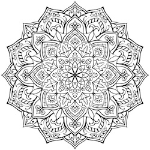
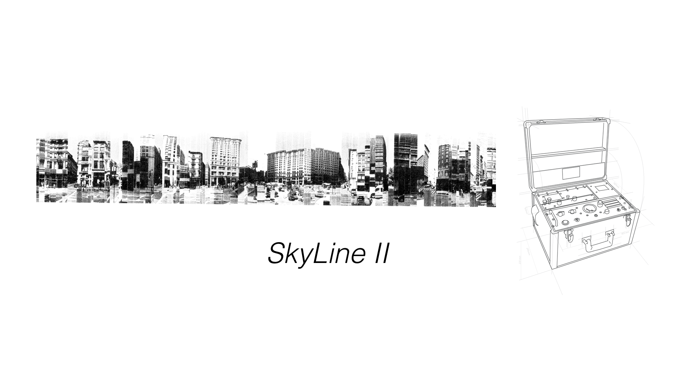

<!-- .slide: data-background="#000000" -->
# What are the chances?

---

DEC 2009

Note:
In December 2009, I was working as **clinical psychologist and expressive art therapist** and starting the annoying process of **making your own website for my practice**.

I was **teaching my self** flash to make my own website for my practice as an art therapist. 
Googling around I search for this [“processing XML”] 

--

Note:
which leads me to **Processing** documentation

--

Note:
I was shocked and amazed!!  

People were doing art with code.
…I feel that I tap into a world of **misfits** like me.

Beside the fact that I always have been a nerd that like computers. Buenos Aires, is together with Paris and Upper West Side, is one of the last places on the world where people do (and like) Psychoanalyst.

So while everybody was into this guy:

--

<!-- .slide: data-background="#000000" -->

 <!-- {_class="fragment"} -->

Note:
was a super fan of this other guy.
… his archenemy. Carl Gustave Jung.

(he actually looks like my grand father)

Like most **archenemies**, they use to be friends. Jung was the favorite disciple. Freud name him his sucesor and put him in charge of the International Psychoanalytical Association.

--

Note:
They disagree on the origin of libido and in the scope of unconscious. Freud, father of this ideas, thought the libido was just sexual, and the unconscious made of personal memories.

Jung disagree that the libido was only a sexual. He also believed that deeper than the personal unconscious was a deep **collective ocean of shared psychological content**. Not just instincts but a whole set of psychological structures, he later call archetypes. They manifest in mythological themes, images, patterns visible along generations and around the world.

--

Note:
For him the personal psique emerge from this collective sea.

--

<iframe class='fit' width='100%' height='100%' style='min-height: 1000px;' data-src='http://localhost:8000/tangram.html?style=emerge#15.3023/-22.9476/-43.1791'></iframe>

Note:

Like islands over the sea.
[Note, this are not island… I’m just drowning Rio]

--

Note:
This is the diagram of the psychic structure for Jung.
Note how for him deliberated looks like a mandala.

The term mandalas can be use loosely to any symbolic circular forms that speaks refers to "the hole". We can find them on all mayor religions.

--

Note:
Jung's theory open the doors to new was of using mythological and symbolic content to amplify emerging archetypes.

--

Note:
With it, different expressive languages like music, dance...

--

Note:
sculpture and painting serve as a non verbal medium that facilitate this practice.

--

Note:
I'm not gonna lie, there were a LOT of mandalas involve.

--

Note:
But also dancing, singing, etc.
Each different language have the ability to think and said things in different ways. 

--

Note:
Movement for example, it fluctuates over time... was this ability to transform things.... you enter into an activity with an emotion and thought dance you can move it, transform it into something else....

--

Note:
Painting is more like a sedimental process... you bring something and you put it on paper... then you add more and more stuff... an image slowly appears over time.

--

Note:
So I was there looking to all this hybrid artist using code as a language, wondering about code as an expressive language.
About wich unique posibilities this language unlocks for us. 
Also I'm a huge nerd and fun of computers since I use Logo Writer in schools... My first linux distribution was Redhat 5.1

Any way I was in nerd heaven.
I send emails to all the artist could found. 
Only one reply

--

Note:
... Chiss Sugrue.
So I did...
I got in touch w Diego
How suggest to apply for interactivos telefonica.
And again... I did.

--

*Fundacion Telefonica* - **INTERACTIVOS** 2010

Note:
Here we are in interactivos 2010. I made long lasting friends there, like Tomas Rawski.

Some of the most fantastic things are un expected. And I feel this new community I tapped into was one of them.

Jung have a interesting concept call **synchronicity**.
On his work he notice that In his diaries, what later he also ilustrate and become the red book.

---

<!-- .slide: data-background="#000000" -->

Note:
… he wrote a series recurring apocalyptic dreams he was having. 
Those dreams scare him to the point that he was concern of his own mental health. 

--

<!-- .slide: data-background="#000000" -->

Note:
Then he start hearing similar dreams by some of his patients.
He was conflicted with the fact that maybe he was some how influencing them.

--

<!-- .slide: data-background="#000000" -->

Note:
When the first world war start, it was clear for him that actually everybody was have been feeling something coming... 
In the same way animals feels natural disasters before they happen... 
There was something in there air that was pict subconsciously by him and his patient..

Because this events didn't directly respond to a cause and effect relation. He call them acausal events. And he thought they could be explain because of the collective incouncius

In June 2011  (five years ago)...
without any notice....
and after 50 years of lying dormant a volcano at the south of Chille call Puyehue made eruption.

--

<!-- .slide: data-background="#000000" -->

JUN 2011

--

<!-- .slide: data-background="#000000" -->

Note:
This eruption ejected around one hundred million tons of ash, sand and pumice. 

--

<!-- .slide: data-background="#000000" -->

Note:
This eruption ejected around one hundred million tons of ash, sand and pumice. 

--

<!-- .slide: data-background="#000000" -->

Note:
Days after, the plume travels all the way to Buenos Aires. 

--

<!-- .slide: data-background="#161616" -->
<iframe class='fit' width='100%' height='100%' style='min-height: 1000px;' data-src='tangram.html?style=puyehue#6.81187/-37.148/-63.976'></iframe>

Note:
In it path..

--

<!-- .slide: data-background="#000000" -->

 <!-- {_class="fragment"} -->
 <!-- {_class="fragment"} -->

Note:
the ashes bring destruction.
- all flights cancel across the southern half of the continent
- Nilahue River went up to 113° and killed around 4.5 million fishes
- heart attacks and got throat cancer on the livestock
- fluoride intoxication in sheep, cattle and horses
- bring five years of drought on Chubut and Rio Negro
This incredible force of nature brings a lot of destructions on it's way

--

<!-- .slide: data-background="#000000" -->
<iframe src="https://player.vimeo.com/video/31940579" class='fit' width='100%' height='1000px' frameborder="0" webkitallowfullscreen mozallowfullscreen allowfullscreen></iframe>

Note:
During the volcano I was working on a project that use kinect camera to do a projection mapping of a ecosystem simulation over a sandbox. My goal was to invite user to interact with it, and by that bring destruction that will take some time to heal and go back to homeostasis. The scale of the volcano eruption had a great influence in this peace. I replace the sand by volcanic ashes, and work hard on it to make the algorithms as complex and realistic as I could. For that I had to learn shaders. It wasn't easy, but at the end was very satisfying to see that the people interacting with it. I like to think that something of what we experience that year could be re experienced in this particular way. In order to think it in a different and healing way.

--

<!-- .slide: data-background="#000000" -->

**Efecto Mariposa** (Butterfly effect)

Note:
There is something that give us pleasure of having the illusion of controlling chaos and chance. Even when we see that the repercussions of our interactions scape our perception of understanding... we find confort in the illusion of control.

--

<!-- .slide: data-background="#000000" -->
<iframe src="https://player.vimeo.com/video/30684308?loop=1&title=0&byline=0&portrait=0" width="640" height="478" frameborder="0" webkitallowfullscreen mozallowfullscreen allowfullscreen></iframe>
<iframe src="https://player.vimeo.com/video/29896245?loop=1&title=0&byline=0&portrait=0" width="640" height="480" frameborder="0" webkitallowfullscreen mozallowfullscreen allowfullscreen></iframe>

<iframe src="https://player.vimeo.com/video/29894099?loop=1&title=0&byline=0&portrait=0" width="640" height="480" frameborder="0" webkitallowfullscreen mozallowfullscreen allowfullscreen></iframe>
<iframe src="https://player.vimeo.com/video/29887776?loop=1&title=0&byline=0&portrait=0" width="640" height="480" frameborder="0" webkitallowfullscreen mozallowfullscreen allowfullscreen></iframe>

Note:
Efecto Mariposa was made using openFrameworks.
After this work was expose I start thinking on how to give back. On what could be the best way to open source this work. As a tool. 
Open Source it into an OF addon: ofFX

--

Note:
thanks to that I meet Zack Liberman...

--

<!-- .slide: data-background="#000000" -->

Note: he was the one that suggest applying to the master in design and technology at parsons... which I did... 

--

<!-- .slide: data-background="#161616" -->
<iframe class='fit' width='100%' height='100%' style='min-height: 1000px;' data-src='tangram.html?style=bue-nyc#3.8/5.83/-62.89'></iframe>

Note:
and I got to come to NYC.

--

<!-- .slide: data-background="#000000" -->
  
  

Visual Systems for CLOUDS Documentary

Note:
While I was working on the visual system on CLOUDS w James and Jonathan...

--

<!-- .slide: data-background="#000000" -->
<iframe class='fit' src="https://www.google.com/maps/embed?pb=!1m0!3m2!1sen!2sus!4v1463075256574!6m8!1m7!1sp1dCLliwGRUAAAQZDaBD0w!2m2!1d40.72371832370289!2d-73.95171632224185!3f44.320821265143294!4f-15.56789776591117!5f0.7820865974627469" width="100%" height="1000" frameborder="0" style="border:0" allowfullscreen></iframe>

Note:
I meet Jen in this coorner on Green point.

--

<!-- .slide: data-background="#161616" -->
<iframe class='fit' width='100%' height='100%' style='min-height: 1000px;' data-src='tangram.html?style=sfc-nyc#5.47188/39.742/-99.548'></iframe>

Note:
She also just arrive to NYC move by her own series of random events.
We meet... 
we fall in love... 
we got marry...
we have a kid and we are inmensly open to all this new experience of been parents

--

<!-- .slide: data-background="#000000" -->

Note:
which we have absoultely no idea how to deal with :)

But is not just that randoms happens. 
I think also is about keep being open... dancing with it.
While working on my thesis in 2014.

---

[**Skyline II**](http://patriciogonzalezvivo.com/2014/skylines/skylines.php?v=02)

Note:
I was working on a series of projects is about awareness and the tools we use to see the world around us.
This is a machine that prints the large-scale transitions of the horizon on a path from the city to the mountains. 

--

<!-- .slide: data-background="#000000" -->

Note:
For this project I was scrapping google street view data to construct this continues horizon.
You can see how using google's routing service I choose a path, to then make different request to the GoogleStreetView API

--

<!-- .slide: data-background="#000000" -->

Note:
I wasn't completely happy on how this look so I was trying some other things.
I was trying to put this "bubles" togther and put a camera go from one to the other... 
but was basically going trough this wall meshes... kind of disaster. Hulking out the virtual streets

--

<!-- .slide: data-background="#000000" -->

Note:
Then I found this... there was some low definition depth data that could be accesss throught the API

--

<!-- .slide: data-background="#000000" -->

Note:
And now we have some Z. At this point I was: "well, I worked on CLOUDS, I can only use the vertex points and get away with it".

--

<!-- .slide: data-background="#000000" -->

--

<!-- .slide: data-background="#000000" -->

<!-- .slide: data-background="#000000" -->
<!-- <iframe class='fit' width='100%' height='100%' style='min-height: 1400px; position: absolute; top: 0px; right: 0px;' data-src='http://patriciogonzalezvivo.com/2014/pointcloudcity/wash-sq/'></iframe> -->
<!-- <iframe src="https://player.vimeo.com/video/89982874" width="1280" height="800" frameborder="0" webkitallowfullscreen mozallowfullscreen allowfullscreen></iframe> -->

--

Note:
I start pullishing

--

Note:
until start making sense for me.

--

<iframe class='fit' width='100%' height='100%' style='min-height: 1400px; position: absolute; top: 0px; right: 0px;' data-src='http://patriciogonzalezvivo.com/2014/skylines/queensboro/'></iframe>

Note:
in lot of things it was like the begining of photography.

--

Note:
I put my camera some where... and then set a robot to retrive this points of information from googles evil servers.

--

Note:
I had to wait this digital landscapes reviel. develop over time.

--

Note:
Preparing for this talk I want to do some new point clouds... but I discovery that google change their API... so this point clouds are somehow limited editions

---

Note:
Since AUG 2014 I had the inmense priviledge of start working for Mapzen.

--

Note:
Mapzen was a stellar line up of truly incredible and amazing people.
Working with this falks is a fantastic priviledge.

--

 

[Experiments on **3D Labels** (C++)](https://vimeo.com/107190391)

Note:
working there I have been hable to do all sort 

--

   

[Experiment on LIDAR + SfM + OpenStreetMap (Python/C++)](https://mapzen.com/blog/point-clouds)

Note:
of exploratory projects

--

 

 

[Tangram styles (WebGL)](patriciogonzalezvivo.github.io/tangram-sandbox/)

Note:
pushing the limits

--

<!-- .slide: data-background="#000000" -->

 

 

*Tangram styles*

Note:
of what digital cartography can look

--

<!-- .slide: data-background="#000000" -->
<iframe class='fit' width='100%' height='100%' style='min-height: 1000px;' data-src='tangram.html?style=randomCity&animate=true#15/40.7076/-74.0146'></iframe>

*RandomCity*

[* Inspired on Ryoji Ikeda work](http://www.ryojiikeda.com/)

Note:
today

--

<!-- .slide: data-background="#020303" -->

  

*Line of Sight*

Note:
[I think you can tie Mapzen in with openness + chance == interesting things; make the point that Mapzen is working in the open; share things *other* ppl have

One of the fantastic things about my work is that completely in the open.

--

**Geraldine** Sarmiento (@sensescape)

Note:
So beside working with the incrediblle 
Geraldine Sarmiento

--

**Weili** Shi (@shiweili)

Note:
we make tools for others to be creative. Like Weili Shi.

---

Note:
I start coding with this book of Daniel Shiffman.
This book so empowering to me. Was **gateway** to a lot of posibilities

--

Note:
That's why, as a side and long term project, I start writing a book to help others to start with shaders.
Back in the days of Efecto Mariposa, was very hard to start learning what was consider this dark art of GLSL Shaders.

--

Note:
Where do you start teaching such a low level language like Shaders?
Who a hello world look like in an enviroment designed only to draw pixels?

--

Note:
Or more generaly. What's the best way to learn a language?

So together with the writing, come ideas to make it more didactic. 
Designing little helpers, that reduce the distance between the reading and the coding.

--

<iframe class='fit' width='100%' height='1000px' data-src='http://thebookofshaders.com/05'></iframe>

Note:
For me live coding experience was non-negotiable. If the reader was to setup or compile something to try a concept, I lost him.
So I made this embebed code editor.

I add some widgets to it, that make more tangable tweaking.

Or this other GLSL graph plotter... to visualize one dimentional operations.

This openSource project also open new chances of working with others.

--

<iframe class='fit' width='100%' height='100%' style='min-height: 1000px;' data-src='tangram.html?style=collaborators#3/20/10'></iframe>

Note:
This are some of the people that have join this project collaborating donating time and effort helping others to learn.

I just so thanks full to them.
They had translate the book of shaders to Japanise, Korean, Spanish and French. The italian translation is on the way.

--

Lygia Clark

--

<!-- .slide: data-background="#000000" -->

---

**[o]** openFrame.io 

*by Ishac Bertran (@ishacbertran) & Jon Whol (@jonwohl)*

Note:
Another project I got to collaborate totaly by chance is openFrame.
I help Ishac and Jon to run shaders on the RaspberryPi through a program I made call glslViewer

--

<!-- .slide: data-background="#000000" -->

Note:
And from some old screen monitor I found in my basement and a raspberryPi. 
I got to setup this frame... that I can push content easily from the web

--

<!-- .slide: data-background="#000000" -->
<!-- <iframe src="https://vine.co/v/ixunMhF10EF/embed/simple" width="600" height="600" frameborder="0"></iframe> -->

<iframe src="https://vine.co/v/ixun5zIu2eq/embed/simple" width="600" height="600" frameborder="0"></iframe>

Note:
Here is the frame on our livingroom.
The fact of seen your work everyday, and constantly, have being changing the way I have been working

--

<!-- .slide: data-background="#000000" -->
<iframe src="https://vine.co/v/ixuihjh1Un6/embed/simple" width="600" height="600" frameborder="0"></iframe><iframe src="https://vine.co/v/ixunethi9MB/embed/simple" width="600" height="600" frameborder="0"></iframe>

Note:
I feel that is re introducing a dialog with my work in daily bases, and this have being incerdible fructific

--

<!-- .slide: data-background="#000000" -->
<iframe class='fit' width='100%' height='100%' style='min-height: 800px;' data-src='edit.html?log=160519125734&menu=false&multipleBuffers=false&theme=tomorrow-night-eighties&canvas_size=halfscreen&canvas_snapable=true'></iframe>

Note:
taking a moment to describe what a shader is and why I like them so much, I will say:

- is a coding language... 
    - a series of direction, but from the point of view of a single pixel.

I like it because of their **simplicity**, **low level** and **restrictions**

They seems like a HAIKUs to me.
There is no library to reference... just mathematical functions. 
So is very minimal.
And at the end all you do is images.

Working back a forth with the frame... is mostly like sketching ideas in postfix and then puting them in your freezer.

--

<iframe class='fit' width='1270px' height='760px' data-src='gallery.html?logs=160219113536,160219113008,160219112614,160518160824,160226222825,160301005406,160518160746,160518160802,160518161206,160302101718,160518161234,160302101922,160518161258,160304202332,160518161324,160306112725,160308160958,160313020334,160313025607,160518161359,160518161425,160510011212,160506171132,160306213426'></iframe> 

Note:
This are small ideas of something that cames up. 
A gesture gestures, a handy ecuation, a way to animate something.
I try to keepthem minimal and simple to show one thing I found interesting.

Jung use to do something similar but for instrospection. Can you guess?

--

<!-- .slide: data-background="#000000" -->

Note:
Mandalas strickty speaking is a meditation technique practice in tibetan budism.

--

Note:

---

Note:
is hard to talk on pseudo chance and not mentioning Casey Reas work

--

<iframe class='fit' width='100%' height='600px' data-src='graph.html'></iframe>

Note:
On thing about the shading language is it doesn't have commands for random. So you have to make it by your own.

So here we have X and Y. 
Let's start by making a sine wave.
Now let's only keep the fractional part of this wave. Note how the wave gets choped on the negative part.
Let's exagerate this effect.
You can still see the top and the botom of the wave.
It's not perfect. You can see that is not perfectly distributed. 
There is some bias to the center. .5
But this is esentially the only pseudo random you will find.

--

<!-- .slide: data-background="#000000" -->
<iframe class='fit' width='100%' height='100%' style='min-height: 800px;' data-src='edit.html?log=160306213426&menu=false&multipleBuffers=false&theme=tomorrow-night-eighties&canvas_size=halfscreen&canvas_snapable=true'></iframe>

Note:
So I recode the famous 10 Print.
And I combined to this other project I made for Mapzen showing data display on tangram.

--

<!-- .slide: data-background="#14131A" -->
<iframe class='fit' width="100%" height="100%" style='min-height: 1000px;' data-src="http://tangrams.github.io/WeatherOverTime/"></iframe>

Note:
Behind the scenes here I'm encoding this data set into an image using the RGB channels. You can see, each line of tha image that use by each weather station in this map, by clicking on it.

--

<!-- .slide: data-background="#000000" -->

Note:
This is how the "big picture" looks like.
In this point is looks very random, but some interesting patterns emerge.
Specially if you divide the types of data, a feeling comes from it.

So I replace the function to obtain random with something that use this texture as an imput

--

<!-- .slide: data-background="#000000" -->
<canvas class='sandbox fit' data-fragment-url='shaders/10print-wind_dir.frag' data-textures='shaders/data.png' width='500px' height='900px' ></canvas>

<canvas class='sandbox fit' data-fragment-url='shaders/10print-wind_speed.frag' data-textures='shaders/data.png' width='500px' height='900px' ></canvas>

<canvas class='sandbox fit' data-fragment-url='shaders/10print-temp.frag' data-textures='shaders/data.png' width='500px' height='900px' ></canvas>

wind direction &nbsp; &nbsp; &nbsp; &nbsp; &nbsp; &nbsp; &nbsp; &nbsp; &nbsp; &nbsp; &nbsp; wind speed &nbsp; &nbsp; &nbsp; &nbsp; &nbsp; &nbsp; &nbsp; &nbsp; &nbsp; &nbsp; temperature

Note:
This is a maze constructed with wind speed, direction and temperature 
Tempted with this idea of wind-random. I made a I Ching shader that feeds from it

--

<!-- .slide: data-background="#000000" -->

<iframe class='fit' width='100%' height='100%' style='min-height: 800px;' data-src='edit.html?log=160519211717&menu=false&multipleBuffers=false&theme=tomorrow-night-eighties&canvas_size=halfscreen&canvas_snapable=true#/shaders/data.png'></iframe>

Note:
But there is something disrispectuf with this idea. 
a. One nobody I know... knows the 64 hexagrams, to the point they can be reading this...
b. The context is in apropiate.

--

<!-- .slide: data-background="#000000" -->

Note:
For Jung, the distintion between regular chance and synchronicity is the psicological state of mind.
Requires some sort of presence or intention on looking for answers.

Is not something that is not just vomit to you.
To be trusful need to be framed in a context.

--

I want to show you a diferent peace

---

## Thank you

[patricio.io](http://patricio.io) | [@patriciogv](https://twitter.com/patriciogv)

--

[**patriciogonzalezvivo**.github.io/**eyeo16**](http://patriciogonzalezvivo.github.io/eyeo16/)

Note:
here you can find this presentation.
