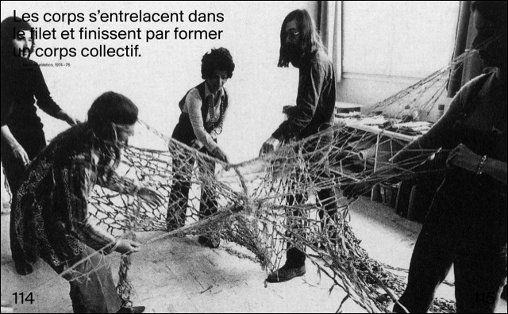
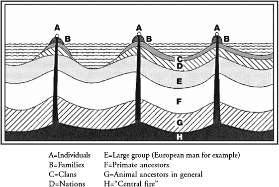

<!-- .slide: data-background="#000000" -->
# What are the chances?

Note:
I want to start by say what an honor is to be here with you.

---

DEC 2009

Note:
In December 2009, I was working as **clinical psychologist and expressive art therapist** and starting the complicated process of **making your own website**.

I was **teaching my self** flash, googling around, until I search for this [“processing XML”] 

--

Note:
this links me to **Processing** documentation

--

Note:
Took me a while to understand that people were doing **art with code**.
…I felt that I tap into a world of **misfits** like me.

Beside the fact that I always have been a nerd that like computers. **Buenos Aires**, is together with Paris and Upper West Side, is one of the last places on the world where people do (and like) **Psychoanalyst**.

So while everybody was on to this guy:

--

<!-- .slide: data-background="#000000" -->

 <!-- {_class="fragment"} -->

Note:
I was on to this other guy.
… his archenemy. Carl Gustave Jung.

Like most **archenemies**, they use to be friends. Jung, was in fact his favorite disciple. Freud even name him his sucesor at the head of the International Psychoanalytical Association.

--

Note:
They end up disagreeing in lot of things, but particularly two of them: a) the nature of **libido** and b) the scope of **unconscious**. Freud, father of this ideas, thought the libido was purely sexual energy, and the unconscious made of personal memories.

For Jung, the libido was not only sexual, and the unconscious was way deeper. For him was a **collective ocean of shared psychological content**. Not just instincts but a whole set of psychological structures, he later call **archetypes**. 

--

We can find archetypes by finding patterns and correlations in different mythologies, believe systems, novels, movies, etc. For Jung this are common psychological structures, that sue and share. [Something like an arcane human API.]

Jungian therapy practices is based on the use of symbolic and mythological knowledge to amplify emerging archetypes. Helping them to emerge to conciseness.

Though he also open the doors to the use of ritual and expressive languages as non-verbal framework to exploration and transformation of psychological content.

--

Lydia Clark

Note:
In the 70's groups like those Lygia Clark was running, incorporate rituals and sensorial stimulation to happenings... soon they were using it for healing. 

--

<!-- .slide: data-background="#000000" -->

Note:
Since then, different expressive languages like music, dance...

--

Note:
sculpture and painting serve as a non verbal medium that facilitate this practice.

--

Note:
Each different language have the ability to think and said things in different ways. 

--

Note:
Movement for example, it fluctuates over time... was this ability to transform things.... you enter into an activity with an emotion and thought dance you can move it, transform it into something else....

--

Note:
Painting is more like a sedimental process... you bring something and you put it on paper... then you add more and more stuff... 

--

Note:
Or sculpture is about subtracting, moving and releasing until a recognizable shape appears.

--

Note:
Back to that moment I **discovered processing**. I was there looking to all this hybrid artist using code as a language. Seen for the first time code and computers as an expressive language.
What unique possibilities this language unlocks for us?
What new things this medium allows us to say?

I felt I tap in a community that I want to be part of.
I send emails to all the artist could found. 
Only one reply

--

Note:
... Chiss Sugrue.
So I did like she said.
I got in touch w Diego Albert.
How suggest me to apply to interactivos Telefónica.
Which I also did.

--

*Fundacion Telefonica* - **INTERACTIVOS** (2010)

Note:
Here we are in interactivos 2010. I made great friends there, like Tomas Rawski, Joaquin Aras, Javier Bilatz, then Jorge Crowe, Guido Corallo, Leo Solas and Cris Reinaga.

I think it was particularly great because was unexpected.

I found this old video in my history vimeo of those days.

--

<!-- .slide: data-background="#000000" -->
<iframe src="https://player.vimeo.com/video/23659674?title=0&byline=0&portrait=0" width="1200" height="750" frameborder="0" webkitallowfullscreen mozallowfullscreen allowfullscreen></iframe>

2011

Note:
Everything was exciting and vibran. I was truly feeling that I was integrating more parts of my self.

Jung have a interesting concept call **synchronicity**.
Analyzing his on dreams (and then drawing them in what becomes the famous Red Book)

---

<!-- .slide: data-background="#000000" -->

Note:
… he wrote a series recurring apocalyptic dreams he was having. 
Those dreams scare him to the point that he was concern of his own mental health. 

--

<!-- .slide: data-background="#000000" -->

Note:
Then he start hearing similar dreams by some of his patients.
He was conflicted with the fact that maybe he was some how influencing them.

--

<!-- .slide: data-background="#000000" -->

Note:
Years later, When the first world war start, it was clear for him that actually everybody was have been feeling something coming... 
In the same way animals feels natural disasters before they happen...  There was something in there air that was pict subconsciously by him and his patient..

Because this events didn't directly respond to a cause and effect relation. He call them a-causal events. And he thought they could be explain because of the collective unconscious

.

In June 2011  (five years ago)...
without any notice....
and after 50 years of lying dormant a volcano at the south of Chile call Puyehue made eruption.

--

<!-- .slide: data-background="#000000" -->

JUN 2011

--

<!-- .slide: data-background="#000000" -->

Note:
This eruption ejected around one hundred million tons of ash, sand and pumice. 

--

<!-- .slide: data-background="#000000" -->

Note:

--

<!-- .slide: data-background="#000000" -->

Note:
Days after, the plume travels all the way to Buenos Aires. 

--

<!-- .slide: data-background="#161616" -->
<iframe class='fit' width='100%' height='100%' style='min-height: 1000px;' data-src='tangram.html?style=puyehue#6.81187/-37.148/-63.976'></iframe>

Note:
In it path..

--

<!-- .slide: data-background="#000000" -->

 <!-- {_class="fragment"} -->
 <!-- {_class="fragment"} -->

Note:
the ashes bring 
- destruction.
- everything between days of flights cancel across the southern half of the continent.
- to dead animals

Everybody's life that months have been affected radically for that volcano hundreds of milles aways.

Everything felt fragile.

--

<!-- .slide: data-background="#000000" -->
<iframe src="https://player.vimeo.com/video/31940579" class='fit' width='100%' height='1000px' frameborder="0" webkitallowfullscreen mozallowfullscreen allowfullscreen></iframe>

Note:
Before the volcano arrive, I was working on a **interactive projecting mapping over a sandbox, simulating** the more precise I could **an entire ecosystem with kinect**.

I was inviting the user to interact with it, and by doing that the user bring destruction. Then he have to wait, It takes time to the life on the simulation to go back to homeostasis. 

Although, we can't blame human kind directly for the eruption of the volcano, I use the ashes. For me was a symbol of how little we know. How much less power, and lack control we have.

--

<!-- .slide: data-background="#000000" -->

NOV 2011 - **Efecto Mariposa**

Note:
I had the chance to show this installation several times in South America. 
I saw people getting some pleasure of this illusion of control, even it was designed to get out of control, we really think we can control things... Like when we bang the tv in the side to fix it.

--

<!-- .slide: data-background="#000000" -->
<iframe src="https://player.vimeo.com/video/30684308?loop=1&title=0&byline=0&portrait=0" width="640" height="478" frameborder="0" webkitallowfullscreen mozallowfullscreen allowfullscreen></iframe>
<iframe src="https://player.vimeo.com/video/29896245?loop=1&title=0&byline=0&portrait=0" width="640" height="480" frameborder="0" webkitallowfullscreen mozallowfullscreen allowfullscreen></iframe>

<iframe src="https://player.vimeo.com/video/29894099?loop=1&title=0&byline=0&portrait=0" width="640" height="480" frameborder="0" webkitallowfullscreen mozallowfullscreen allowfullscreen></iframe>
<iframe src="https://player.vimeo.com/video/29887776?loop=1&title=0&byline=0&portrait=0" width="640" height="480" frameborder="0" webkitallowfullscreen mozallowfullscreen allowfullscreen></iframe>

Note:
Although Efecto Mariposa is made in **openFrameworks**, all the computation power comes from the GPU using **shaders**. A shader or two for each one of the sphere I was simulating. The process of learning shaders was hard, because of the lack of documentation about it. I decide to give something back to the OF community by breaking this shaders into modules of an addon, then with I called `**ofFX**`.

--

Note:
That addon becomes very popular...
And thanks the fact that **Zack Liberman** was trying to use it... we meet and get to talk.

--

<!-- .slide: data-background="#000000" -->

Note:
After telling him how much I was wanting to leave the clinical psychology and do more artistic work that he suggest applying to the MFA in design and technology at parsons... which I did... 

--

<!-- .slide: data-background="#161616" -->
<iframe class='fit' width='100%' height='100%' style='min-height: 1000px;' data-src='tangram.html?style=bue-nyc#3.8/5.83/-62.89'></iframe>

2012

Note:
and later, that allows me to get to come to NYC.
NYC is not a friendly city to arrive, without a job. Thankfully thanks the help of some friends like **Natxo Pedreira**, I got some money income and I survive that two years winter.

--

<!-- .slide: data-background="#000000" -->
  
  

2013 - Visual Systems for CLOUDS Documentary

Note:
Other unexpected things happened... James and Jonathan invite me to collaborate in CLOUDS doing some visual systems... and during the interviews, just because Zack talk about to her, I meet Jen.

--

<!-- .slide: data-background="#000000" -->
<iframe class='fit' src="https://www.google.com/maps/embed?pb=!1m0!3m2!1sen!2sus!4v1463075256574!6m8!1m7!1sp1dCLliwGRUAAAQZDaBD0w!2m2!1d40.72371832370289!2d-73.95171632224185!3f44.320821265143294!4f-15.56789776591117!5f0.7820865974627469" width="100%" height="1000" frameborder="0" style="border:0" allowfullscreen></iframe>

Note:
We randomly went for coffee in this corner, like most people do here in New York. 
A networking coffee became a dinner, and then a life time adventure.

--

<!-- .slide: data-background="#161616" -->
<iframe class='fit' width='100%' height='100%' style='min-height: 1000px;' data-src='tangram.html?style=sfc-nyc#5.47188/39.742/-99.548'></iframe>

Note:
She also was new to NYC. She was also open to chance... falling a path that brings her all the way from the other coast.
We fall in love. We move together. We got married. All that in less than a year. 

...and now we have a kid.

--

APR 2015

Note:
Lucas.
I consider my self immensely lucky to have such a great partner to dance against uncertainty.

---

MAY 2014 - [**Skyline II**](http://patriciogonzalezvivo.com/2014/skylines/skylines.php?v=02)

Note:
In 2014, for my thesis...
I was working on a series of **projects about awareness and the tools we use to see the world around us**.
This machine in particularly prints a large-scale horizon showing the transition between the city and the mountains.

--

<!-- .slide: data-background="#000000" -->

Note:
To construct this continues horizon I was scrapping google street view data.

--

<!-- .slide: data-background="#000000" -->

Note:
Finding ways to **stitch the panoramic** images together.

--

<!-- .slide: data-background="#000000" -->

Note:
Then I found this **depth data in their API**

--

<!-- .slide: data-background="#000000" -->

Note:
Having z allows me to add up point clouds.

--

<!-- .slide: data-background="#000000" -->

Note:
The results were for me like inventing **photography** again.

--

<!-- .slide: data-background="#000000" -->

<!-- .slide: data-background="#000000" -->
<!-- <iframe class='fit' width='100%' height='100%' style='min-height: 1400px; position: absolute; top: 0px; right: 0px;' data-src='http://patriciogonzalezvivo.com/2014/pointcloudcity/wash-sq/'></iframe> -->
<!-- <iframe src="https://player.vimeo.com/video/89982874" width="1280" height="800" frameborder="0" webkitallowfullscreen mozallowfullscreen allowfullscreen></iframe> -->

Note:
I have to choose a location, put my camera in focus, and then **wait for the calls to come back with points of light**.

--

Note:
**This public spaces emerge slowly from the deepness of this private databases**.

--

Note:
I work with the style until I felt the result were more honest about the nature of the process.

--

<iframe class='fit' width='100%' height='100%' style='min-height: 1400px; position: absolute; top: 0px; right: 0px;' data-src='http://patriciogonzalezvivo.com/2014/skylines/queensboro/'></iframe>

Note:
I try to prepare some point clouds for this talk. Only to find out that the API change.

--

Note:
This images, becomes limited editions. 

--

Note:
Postcards of an era where LIDar data was hard to get, and companies were driving cars creeping the hell out of everybody. 

--

Note:
Ahh... the early 2010's... 

I wonder how much of our decade is about recreating with technology, the Jungian concept of collective unconscious. 

Bid data, machine learning, AI stuff.... all had this promise of bringing some light to the uncertainty of the daily life.
We think that technology will give us back some certainty. 

Illusion of control.

[I could add an image of Luke Skywalker and DathVader, as the archetype of finding in technology power... but loosing hour humaneness in the process]

---

Note:
Since AUG 2014 I had the immense privilege of working for Mapzen. We do all in the open. That's an incredible privilege.

--

Note:
Mapzen also was a stellar line up of amazing people. Is truly an honor working with this crew.

I'm thankful every day that I get to do weird experiments

--

 

[Experiments on **3D Labels** (C++)](https://vimeo.com/107190391)

Note:
like this one 

--

   

[Experiment on LIDAR + SfM + OpenStreetMap (Python/C++)](https://mapzen.com/blog/point-clouds)

Note:
or this other one

--

 

 

[Tangram styles (WebGL)](patriciogonzalezvivo.github.io/tangram-sandbox/)

Note:
or pushing the limits

--

<!-- .slide: data-background="#000000" -->

 

 

*Tangram styles*

Note:
of what digital maps can look like... 

--

<!-- .slide: data-background="#1D1D1D" -->
<iframe class='fit' width="100%" height="100%" style='min-height: 1000px;' data-src="tangram.html?style=tilt-gotham-orig#15/40.7076/-74.0146"></iframe>

--

<!-- .slide: data-background="#000000" -->
<iframe class='fit' width='100%' height='100%' style='min-height: 1000px;' data-src='tangram.html?style=randomCity&animate=true#15/40.7076/-74.0146'></iframe>

2015 - *RandomCity*

[* Inspired on Ryoji Ikeda work](http://www.ryojiikeda.com/)

--

<!-- .slide: data-background="#020303" -->

  

*Line of Sight*

Note:
Even projects were I animate the prediction of 1700 satellites orbits.

--

<!-- .slide: data-background="#020303" -->
<iframe class='fit' width="100%" height="100%" style='min-height: 1000px;' data-src="http://patriciogonzalezvivo.github.io/LineOfSight/"></iframe>

*LineOfSight*

Note:
Mapzen was other teams beside the one I work on (the graphic one). We have a **data, search and routing teams**. 

They do powerful engines in the open that are usually expensive to develop. Companies makes them as an investment, which means close. Companies implement them over and over again, keeping the innovation close and lost.

Thanks to the work coming from the search and routing teams, is the first time this engines are develop in the open, and regular people get to see them and study how they work. We feel that this will help by rising the ceilings on the industry. 

As I said is a privilege to work in Mapzen, not just because I get to work with thoughtful and talented people like

--

**Geraldine** Sarmiento (@sensescape)

Note:
Geraldine Sarmiento (which is here in Eyeo... and you should go and talk to her).
But also because empower others:

--

**Weili** Shi (@shiweili)

Note:
like Weili Shi. That use our stuff for his MFA thesis.

---

Note:
This kind of development on the open reminds me to this other Jungian concept, of emergence. He believe that the psyche emerges from the collective unconscious. 

--

<iframe class='fit' width='100%' height='100%' style='min-height: 1000px;' data-src='http://localhost:8000/tangram.html?style=emerge#15.3023/-22.9476/-43.1791'></iframe>

Note:

Like islands over the sea. 
[Note, this are not island… I’m just drowning Rio... visualization I'm currently working on about the consequences of not waking up]

Speaking of empowering and conciseness...

---

Note:
How many of you had start coding with this book of Daniel Shiffman. 
This book was **gateway** to coding.

--

Note:
In the spirit of it, I start my own book for those that want to learn shaders... so they don't have to replicate from scratch the esoteric experience of teaching yourself shaders.

--

Note:
I call it The Book of Shaders... as a satiric reference to The Book of Shadows.
In it I start dealing with questions about. Where to start? What's the best way to learn or teach code? How a shader "hello world" example should look like? What are the minimum requirements terms of equipment, conceptual and technical?

--

Note:
So together with the writing and thinking metaphors to explain concept. I found my self developing tools around the book. An ecosystem of apps that allows student to live code... helps them understand by tweaking and changing. Also tools that help them store, share and show their work.

--

<iframe class='fit' width='100%' height='1000px' data-src='http://thebookofshaders.com/05'></iframe>

Note:
The live coding editor, was crucial. Let's people have a tangible experience of what they are doing.

Also the fact that can be embebed was very important. Reducing the distance between the reading of a concept and the trying of it in code. 

The helpers to tweak and change variables was very helpful to make abstract concept more tangible. For example a vec3 can be a color, a position or direction. This concept are interchangeable in the shader. Because shaders are basically mathematical functions and vectors have that plasticity.

I have a close relationship with this tools, not only because I made it, but also because I use a stand alone instance of it, in my regular bases.

--

<iframe class='fit' width='100%' height='1000px' data-src='edit.html'></iframe>

Note:
The book of shaders also have open new chances of collaborating with others.

--

<iframe class='fit' width='100%' height='100%' style='min-height: 1000px;' data-src='tangram.html?style=collaborators#3/20/10'></iframe>

Note:
This are some of the people that have join this project collaborating donating time and effort helping others to learn.

I just so **thanksful** to them.
They had translate the book of shaders to Japanise, Korean, Spanish and French. The italian translation is on the way.

Also talking to them is bringing new voices. I have this feeling that **the project start having a life in it's own**.

--

<!-- .slide: data-background="#000000" -->

Note:
I love this images.

Back to the jungian conception of the psyche

--

Note:
He made this diagram of the psychic structure.
Note how for him deliberated looks like a mandala.

The term mandalas can be use loosely to any symbolic circular forms that speaks refers to “the hole”. We can find them on all mayor religions.

--

 <!— {_class=“fragment”} —>
 <!— {_class=“fragment”} —>

Note:
Jung it self use to draw mandalas daily as a way to check with him self. As a way to take "snapshots" of his inner self.

--

<!-- .slide: data-background="#000000" -->

Note:
Mandalas are original from the Tibet. Are made by monks during meditation. They are in essence ephemeral. The product of a moment.

--

<!-- .slide: data-background="#000000" -->
<iframe width="853" height="480" src="https://www.youtube.com/embed/LcJWazzEUKk" frameborder="0" allowfullscreen></iframe>

Note:
Once they are done, they are erased.

Another project that The Book of shaders open was a collaboration
---

**[o]** openFrame.io 

*by Ishac Bertran (@ishacbertran) & Jon Whol (@jonwohl)*

Note:
width Ishac and Jon. They are using some of the tools I made for the book to display shaders as artwork in their openFrame project.
--

<!-- .slide: data-background="#000000" -->

Note:
After repurposing some trashed screen monitors I found in my basement, and hooking it up to a RaspberryPi, 

--

<iframe src="https://vine.co/v/ixun5zIu2eq/embed/simple" width="600" height="600" frameborder="0"></iframe>

Note:
I had my openFrame working, and since then I use it to

--

<iframe class='fit' width='1270px' height='760px' data-src='gallery.html?logs=160219113536,160219113008,160219112614,160518160824,160226222825,160301005406,160518160746,160518160802,160518161206,160302101718,160518161234,160302101922,160518161258,160304202332,160518161324,160306112725,160308160958,160313020334,160313025607,160518161359,160518161425,160510011212,160506171132,160306213426'></iframe> 

Note:
- Sketch simple ideas
- a handy equation
- an interesting animation

--

<!-- .slide: data-background="#000000" -->
<iframe src="https://vine.co/v/ixuihjh1Un6/embed/simple" width="600" height="600" frameborder="0"></iframe><iframe src="https://vine.co/v/ixunethi9MB/embed/simple" width="600" height="600" frameborder="0"></iframe>

Note:
Shaders is the language that I choose today.
And in this format helps me mostly because of the restrictions.

- RaspberryPi are slow and underpowered.
- Shaders have a minimal API which mostly consist on mathematical operations
- There are no libraries
- There is no other output than images.

In lot of way they are similar to 

--

<!-- .slide: data-background="#000000" -->
<iframe class='fit' width='100%' height='100%' style='min-height: 800px;' data-src='edit.html?log=160519125734&menu=false&multipleBuffers=false&theme=tomorrow-night-eighties&canvas_size=halfscreen&canvas_snapable=true'></iframe>

Note:
haikus... all you have to do is describe in few sentences an image.

Also because of the nature of the GPU arquetectual... forces me to re think algorithms from the perspective of the pixels... the atoms... the minimal components.

But because is in my living, also push me to make things that can be contemplated for a long time. Kind in the spirit of meditation mandala.

--

<!-- .slide: data-background="#000000" -->
<iframe class='fit' width='100%' height='100%' style='min-height: 800px;' data-src='edit.html?log=160302101618&menu=false&multipleBuffers=false&theme=tomorrow-night-eighties&canvas_size=halfscreen&canvas_snapable=true'></iframe>

Note:
While we watch this I want you to think, in the people that have help you.

--

<!-- .slide: data-background="#000000" -->
<iframe class='fit' width='100%' height='100%' style='min-height: 800px;' data-src='http://player.thebookofshaders.com/?log=160304203331'></iframe>

Note:
In those moments, that you life change, and the people and communities that were there.

--

<!-- .slide: data-background="#000000" -->
<iframe class='fit' width='100%' height='100%' style='min-height: 800px;' data-src='http://player.thebookofshaders.com/?log=160313030533'></iframe>

Note:
I see my own life and can't ignore all the people and communities that had help me. I mention just a few of them. But there are way more.

--

<!-- .slide: data-background="#000000" -->
<iframe class='fit' width='100%' height='100%' style='min-height: 800px;' data-src='http://player.thebookofshaders.com/?log=160510011212'></iframe>

Note:
This talk and thoughts are for them.
I want to thanks them, for their random generosity.

--

<iframe class='fit' width='100%' height='100%' style='min-height: 800px;' data-src='http://player.thebookofshaders.com/?log=160301005406'></iframe>

Note:
Now like any other moment of history the future present with full of uncertainty.

--

<iframe class='fit' width='100%' height='100%' style='min-height: 800px;' data-src='http://player.thebookofshaders.com/?log=160503001527'></iframe>

Note:
I don't know you, but I don' t trust big data, or machine learning... they kind of creep me out... They don't help me sleep better.

--

<!-- .slide: data-background="#000000" -->
<iframe class='fit' width='100%' height='100%' style='min-height: 800px;' data-src='http://player.thebookofshaders.com/?log=160503001527'></iframe>

Note:
On the other hand, feel weave in a community, having friends and allays.

--

[BIG MAP OF all the people that helps me]

Note:
The chance that all this people around the world helped me one way or the other... is totally unlikely... resist all the chances and probabilities. But it happens. 

Thanks you all

---

## Thank you all

[patricio.io](http://patricio.io) | [@patriciogv](https://twitter.com/patriciogv)

--

[**patriciogonzalezvivo**.github.io/**eyeo16**](http://patriciogonzalezvivo.github.io/eyeo16/)

Note:
here you can find this presentation.
