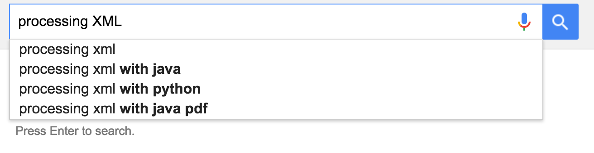
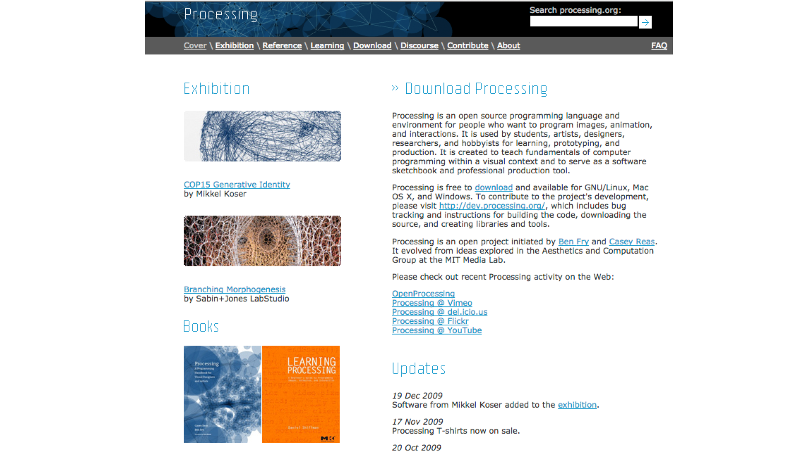

<!-- .slide: data-background="#000000" -->
# What are the chances?

** Patricio Gonzalez Vivo **

*patricio.io* | *@patriciogv*

Note:
Hello my name is Patricio Gonzalez Vivo.
It's an honor to be here. Big thanks to Dave, Jer, and Wes for inviting me to share my work today. Also thanks to my wife, Jen Lowe, who is my collaborator in all things, including this talk.

--

<!-- .slide: data-background="#000000" -->
<iframe class="background" data-src="https://player.vimeo.com/video/23659674?title=0&byline=0&portrait=0#t=18" width="1200" height="750" frameborder="0" webkitallowfullscreen mozallowfullscreen allowfullscreen></iframe>

Note:
**video autoplay at 00:24; no sound**
I thought I'd start by showing a bit of my most embarrassing work on the internet, just to get it out of the way. **this is circa 200?**

--

<!-- .slide: data-background="#000000" -->
<!-- <iframe data-src='tangram.html?style=randomCity&animate=true#15/40.7076/-74.0146'></iframe> -->
<iframe data-src='tangram.html?style=tilt-pericoli&animate=true#15/40.7076/-74.0146'></iframe>

Note:
I'm a developer currently based in NY working at Mapzen, helping to build a 3D Map engine and experimenting with maps & shaders.

But 7 years ago I was a psychologist and expressive art therapist in Buenos Aires.

I'm going to talk about the synchronicities that led me here.

--

<!-- .slide: data-background="#91AC99" -->
<!-- <iframe data-src='https://web.archive.org/web/20100620130219/http://www.arteparasanarte.com.ar/'></iframe> -->

Note:
At the very end of 2009, I was an expressive art therapist in Buenos Aires building a website for my business. The site was "arte para sanarte", which is a worldplay meaning "art to heal". I built it in Flash, and thanks to The Wayback Machine, I recovered it here in GIF form : )
This is the second of a few embarrassing things I’m going to show you, but it’s appropriate because this talk is going to be something of a spiral. 

--

<!-- .slide: data-background="#FFFFFF" -->

Note:
While I was building my website, I needed to figure out how to work with XML files...
...so I searched for “processing XML,” and in the first of many synchronicities, I ended up here...

--

<!-- .slide: data-background="#FFFFFF" -->

Note:
… to a webpage that I’m sure is familiar to a lot of us :)

and it took me a while to understand what was going on on this page... 
that this was a **community of people making ART with CODE**. I felt like I’d tapped into a world of misfits like me, and I wanted to use these tools for expressive art therapy…

--

<!-- .slide: data-background="#000000" -->

Note:
…so let’s spiral back to art therapy for a minute.

The expressive art therapy approach flows between different artistic languages like music, painting, sculpture, and dance... to discover, amplify, and transform emotions and processes in the body. 

It feels like being in a state of play... but these non verbal languages allow you to dive very deep.

Each different language gives you the ability to express your interior landscape in a different way. 

--

<!-- .slide: data-background="#000000" -->

Note:
Sculpture is about letting shape emerge...

--

<!-- .slide: data-background="#000000" -->

Note:
While painting is more like a sedimental process where meaning deposits in layers... one after another...

--

<!-- .slide: data-background="#FFFFFF" -->

Note:
And movement lets you embody a feeling and transform it over time.

--

<!-- .slide: data-background="#000000" -->

Lygia Clark

Note:
We can trace this kind of activities to the pioneer work of Lygia Clark
[Say something about her and her work]

--

<!-- .slide: data-background="#000000" -->

Note:
[Say something about her and her work]

--

<!-- .slide: data-background="#000000" -->

Note:
Expressive art therapy is usually done together with others. It is a very experiential, organic and intense process...

--

<!-- .slide: data-background="#000000" -->

Note:
often we end up constructing a collective mandala... as a way to tie the individual experience to the group.

--

<!-- .slide: data-background="#FFFFFF" -->

Note:
Because I was already working with all of these expressive languages, when I discovered the Processing community, I was moved by the use of CODE as an expressive language.

--

<!-- .slide: data-background="#FFFFFF" -->

Note:
I emailed all the artists I could find who were working in new media, asking them if they knew anyone working in Argentina...

And Chris Sugrue emailed back, introducing me to Diego Alberti... 

I got in touch w Diego, and he suggested that I should apply to interactivos Telefónica. 

(At the time, Telefónica was the Eyebeam of Buenos Aires.)

--

<!-- .slide: data-background="#000000" -->

Note:
I applied, and here we are in interactivos 2010. I made great friends there, like Tomas Rawski, Joaquin Aras, Javier Bilatz, then Jorge Crowe, Guido Corallo, Leo Solas and Cris Reinaga.

--

<!-- .slide: data-background="#000000" -->

Note:
At that time I was also working as an art therapist with a group of kids at the CALOS community center, and that really influenced the project I made at Interactivos...

--

<!-- .slide: data-background="#000000" -->

Note:
...with the kids in mind, at Interactivos I worked on a collective drawing installation. I made a device to try to promote interaction between people instead of alienation.

But I found that the installation didn't get people to interact in the ways I'd imagined...

Adults were interacting in polite ways, almost afraid to break the table... 

While kids used it to discharge all their energy and anxiety. 

I felt that the technological feel of the installation had too much gravity - people interacted much differently with this technical collective mandala than they did when painting a collective mandala on paper.

--

<!-- .slide: data-background="#000000" -->

Note:
These reflections led me to make my next project, efecto mariposa (or "the butterfly effect")

I wanted to make a more sensitive installation, where techonology was hidden beneath a more natural interface.

--

<!-- .slide: data-background="#000000" -->

Note:
The kinect was new back in those days, and I did a realtime simulation of the different spheres of an ecosystem, 

--

<!-- .slide: data-background="#000000" -->
<video width="1920" controls>
  <source data-src="video/IMG_1133.mp4" type="video/mp4">
Your browser does not support the video tag.
</video>

Note:
**add slides of pics of people and hands playing with the system**

programmed in such a way that the ecosystem suffers if people interact with it in an aggressive way... **Then they had to wait until the system regained balance to interact with it again.** 

This forced a gentle experimentation with the system

--

<!-- .slide: data-background="#000000" -->
 <!-- {_class="fragment"} -->
 <!-- {_class="fragment"} -->

Note:
Another synchronicity happened while I was making Efecto Mariposa, but to explain it, and to explain what I mean by synchronicity, I'm going to spiral back to psychology

I'm from Buenos Aires, which, together with Paris and the Upper East Side, is one of the last places in the world where people do Psychoanalysis.

Among Buenos Aires psychologists, everyone was into this guy:

FREUD.

But I was into this other guy.

… his archenemy. Carl Gustave Jung.

Like most archenemies, they use to be friends. Jung was Freud's favorite student. 

--

<!-- .slide: data-background="#000000" -->

Note:
At the begining of the 1900s it was fashionable for psychiatrists to keep dream diaries. Jung had a dream diary, where he drew his dreams.
Jung was very interested in the mythological content of dreams. Freud thought the unconsious content of dreams came from personal memories, but Jung thoghuth that the unconscious content came from a place deeper than personal memories... 

Jung believed that every person's unconscious goes deeper into a collective source of unconscious material... 

That collective source material makes our common mental structures... called Jungian archetypes.

--

<!-- .slide: data-background="#000000" -->
# slide that represents collective unconscious

Note:
**this needs a different visual, archetypes makes no sense**
This idea of a collective unconcious... also serve as an explanation for significan events that seams not be connected by simple cause and effect.
Like dreaming about an event before happening... or been whitness of something that seams the "world" is trying to speak with you.

We want to differenciate this concept from mere chance by using the word synchronicity.

--

<!-- .slide: data-background="#000000" -->

Note:
Back to the collective unconcious... Jung was noticing that he was having recurrent vivid nightmares.

--

<!-- .slide: data-background="#000000" -->

Note:
Nightmares about floods. 

--

<!-- .slide: data-background="#000000" -->

Note:
Nightmares about volcanoes. He worried that he was becoming schizophrenic. **He also noticed that many of his patients were having similar nightmares, and was worried that he was somehow "infecting" them with his own nightmares.**

--

<!-- .slide: data-background="#000000" -->

"On July 31st, immediatly affter my lecture, I learned from the newspapers 

that **war had broken out**. Finally I understood. And when I disembarked in 

Holland on the next day, **nobody was happier than I**. Now I was sure that 

no schizoprenia was threatening me. I understood that **my dreams and my** 

**visions came to me from the subsoil of the collective unconscius**." 

(July 1914)

Note:
**Jung... not really a great guy. But these collective nightmares he was noticing became his support for the idea of a collective unconscious, tapping into some future vision that war was coming.**

--

<!-- .slide: data-background="#000000" -->

Note:
In June 2011  (five years ago)...
without any notice....
and after 50 years of lying dormant a volcano at the south of Chile call Puyehue made eruption.

--

<!-- .slide: data-background="#000000" -->

Note:
This eruption ejected around one hundred million tons of ash, sand and pumice. 

--

<!-- .slide: data-background="#000000" -->

Note:

--

<!-- .slide: data-background="#000000" -->

Note:
View from the sky...

--

<!-- .slide: data-background="#161616" -->
<!-- <iframe data-src='tangram.html?style=puyehue#6.81187/-37.148/-63.976'></iframe> -->
<iframe data-src='tangram.html?style=puyehue#9.765/-40.6179/-72.0973'></iframe>

Note:
Wind, emboding chance again... move the volcanic plume handreds of kilometers a way.

All the way to Buenos Aires, where I was living.
WHAT ARE THE CHANCES???

In their way bring destruction, 
cancelled airports during weeks,
lack of products on the supermarket.

Everybodys life was touch by chance that month...

--

<!-- .slide: data-background="#000000" -->

 <!-- {_class="fragment"} -->
 <!-- {_class="fragment"} -->

Note:
… everything… felt… fragile.

--

<!-- .slide: data-background="#000000" -->
<iframe data-src="https://player.vimeo.com/video/31940579" frameborder="0" webkitallowfullscreen mozallowfullscreen allowfullscreen></iframe>

Note:
This eruption happened while I was working in efecto mariposa.
I used ashes for the installation.

Not only made the work more singnificative for those that experience it, motivates me on working on the algortihms that simulates the different layers of an ecossytem to make it more complex... and less linear... more temperametan and sensitive to the interactions. **influenced by the synchronicity of the volcano, both in the form of the installation, and in creating it's function, to react in unexpected ways.**

Althought is made in openFrameworks, I had to learn how to code in GLSL shaders, in order to do the simulations in realtime.

--

<!-- .slide: data-background="#OOOOOO" -->
<iframe data-src='edit.html?log=160528172431&multipleBuffers=false&theme=neo&canvas_size=halfscreen&canvas_snapable=true&canvas_resizable=true'></iframe>

Note:
I absolutely fell in love with shaders. 

I love shaders because the constrains and the simplicity.

- There are no libraries
- just mathematical functions
- There input is images... and the output is images...

Is just code from the perspective of the pixels... the individual elements that compose an image.

In lot of way they are similar to haikus.  all you have to do is describe in few sentences an image.

This forces me to think algorithms from the perspective of the pixels... the atoms... the minimal components.

And I'm not there yet, but I think this simplicity can be an expressive language.

--

<!-- .slide: data-background="#000000" -->

Note:
So anyway, I grabbed all this layers of simulations I was doing with shaders for efecto mariposa.
I break them into modules... and put them together into an openFrameworks addon.
My first openSource contribution was ofxFX. 

--

Note:
It got very popular and help others to incorporate shaders into their work.

--

<!-- .slide: data-background="#000000" -->

Note:
Also thank to it I meet zach

--

<!-- .slide: data-background="#161616" -->
<iframe data-src='tangram.html?style=bue-nyc#3.8/5.83/-62.89'></iframe>

Note:
And thanks to him, I applied to parsons, and moved to NYC : )

--

<!-- .slide: data-background="#FFFFFF" -->

Note:
In 2014, for my thesis...
I was working on a series of **projects about awareness and the tools we use to see the world around us**.
This machine in particularly prints a large-scale horizon showing the transition between the city and the mountains.

--

<!-- .slide: data-background="#000000" -->

Note:
To construct this continues horizon I was scrapping google street view data.

--

<!-- .slide: data-background="#000000" -->

Note:
Finding ways to **stitch the panoramic** images together.

--

<!-- .slide: data-background="#000000" -->

Note:
Then I found this **depth data in their API**

--

<!-- .slide: data-background="#000000" -->

Note:
Having z allows me to add up point clouds.

--

<!-- .slide: data-background="#000000" -->

Note:
The results were for me like inventing **photography** again.

--

<!-- .slide: data-background="#000000" -->

Note:
I have to choose a location, put my camera in focus, and then **wait for the calls to come back with points of light**.

--

<!-- .slide: data-background="#000000" -->

Note:
**This public spaces emerge slowly from the deepness of this private databases**.

--

<!-- .slide: data-background="#000000" -->

Note:
I work with the style until I felt the result were more honest about the nature of the process.

--

<!-- .slide: data-background="#000000" -->

--

<!-- .slide: data-background="#FFFFFF" -->
<iframe data-src='http://patriciogonzalezvivo.com/2014/skylines/queensboro/'></iframe>

Note:
I try to prepare some point clouds for this talk. Only to find out that the API change.

[note that google api doesn’t have this depth info anymore; limited edition; fragility of working with proprietary tools]

--

<!-- .slide: data-background="#FFFFFF" -->

Note:
This images, becomes limited editions. 

--

<!-- .slide: data-background="#FFFFFF" -->

Note:

--

<!-- .slide: data-background="#FFFFFF" -->

Note:

--

<!-- .slide: data-background="#FFFFFF" -->

Note:
There is an intrinsic fragility of working with proprietary tools

--

<!-- .slide: data-background="#1D1D1D" -->
<iframe data-src="tangram.html?style=tilt-gotham-orig#15/40.7076/-74.0146"></iframe>

Note:
At mapzen we work with open standars... using community mantain data... like openStreetMap data...
Everything we do is open source

--

<!-- .slide: data-background="#FFFFFF" -->

note:
I have the priviledge of working width a stellar line up of some of the best professionals in the feald, doing what I love the most... shaders.

--

 

[Experiments with **3D Labels** (C++)](https://vimeo.com/107190391)

Note:
Our experiments are done in the open 

--

   

[Experiment on LIDAR + SfM + OpenStreetMap (Python/C++)](https://mapzen.com/blog/point-clouds)

Note:
to empower others... 

--

 

 

Note:
Pushing the limits

--

<!-- .slide: data-background="#000000" -->

 

 

Note:
Of what can be done with maps

--

<!-- .slide: data-background="#020303" -->

  

Note:
And with open data
Our goal is to provide tools to others. 

--

<!-- .slide: data-background="#FFFFFF" -->

**Weili** Shi (@shiweili)

Note:
[open source is +++; builds community;]
OpenSource helps builds community.

--

<!-- .slide: data-background="#FFFFFF" -->

**Tyler** Green (@greent_tyler)

Note:
[Community ....]

--

<!-- .slide: data-background="#FFFFFF" -->

Note:
how much of the community in this room exists because of processing and this book?

--

<!-- .slide: data-background="#FFFFFF" -->

Note:
**edit BoS to include Jen as author and re-screen capture for this slide**
[openness and community as a defense against fragility]

This relationship between Openness and community...
is a solution to fragility.

That's why I wrote The Book of Shaders, together with my wife, Jen...

--

<!-- .slide: data-background="#FFFFFF" -->

Note:
So people don't need to replicate my difficult and esoteric process of teach-yourself-shaders.

--

<!-- .slide: data-background="#FFFFFF" -->
other people’s rad shaders they made after reading the book, part I

Note:

https://twitter.com/genarthackparty/status/711000906632994816

--

<!-- .slide: data-background="#FFFFFF" -->
other people’s rad shaders they made after reading the book, part II

Note:

https://twitter.com/wxswxs/status/708091280337797120

--

<!-- .slide: data-background="#FFFFFF" -->
other people’s rad shaders they made after reading the book, part III

Note:

https://twitter.com/jfire/status/698692411048919040

Or like Joseph Fiola work
http://twitter.com/vjzef

--

<!-- .slide: data-background="#FFFFFF" -->
<iframe data-src="http://thebookofshaders.com/log/?index=0&jump=200"></iframe>

Note:
ppl are using the editor everyday

--

<!-- .slide: data-background="#FFFFFF" -->
<iframe data-src='tangram.html?style=collaborators#3/20/10'></iframe>

Note:
**change the stroke color to something bright and add jitter to the locations so all the people display**
This are some of the people that have join this project collaborating donating time and effort helping others to learn.

I just so **thanksful** to them.
They had translate the book of shaders to Japanise, Korean, Spanish and French. The italian translation is on the way.

Also talking to them is bringing new voices. I have this feeling that **the project start having a life in it's own**.

--

<!-- .slide: data-background="#FFFFFF" -->
<iframe data-src='http://thebookofshaders.com/06'></iframe>

Note:
[live coding in the book; talk about interactivity]

So together with the crafting the didactic metaphors. I found my self developing tools around the book.

The embebed live coding editor, was crucial. Shorts the distance from the reading of a concept to the trying it on code.

Also the little helpers to tweak and change variables was very helpful to make abstract concept more tangible. For example a vec3 can be a color, a position or direction. This concept are interchangeable in the shader. Because shaders are basically mathematical functions and vectors have that plasticity.

I have a close relationship with this tools, not only because I made it, but also because I use a stand alone instance of it, in my regular bases. **this is weird**

--

<!-- .slide: data-background="#OOOOOO" -->
     

Note:
**this transition is weird**
Lately I've been writing shaders for an openFrame I made from a raspberryPi and some garbage in my apartment basement

--

<!-- .slide: data-background="#OOOOOO" -->
** add back in the pic of the screens in the basement ***

Note:

--

<!-- .slide: data-background="#OOOOOO" -->
     

Note:
I've been enjoying the challenge of making shaders harmonious enough to live in my house, and I've spiraled back around to mandalas, my old friends from art therapy.

--

<!-- .slide: data-background="#FFFFFF" -->

 <!-- {_class="fragment"} -->
 <!-- {_class="fragment"} -->

Note:
**mandalas something something all cultures**

mandala joke :)

--

<!-- .slide: data-background="#FFFFFF" -->

Note:
back to jung ; collective unconscious

--

<!-- .slide: data-background="#000000" -->

Note:
Tibetan monk mandalas

--

<!-- .slide: data-background="#000000" -->
<!-- <iframe width="853" height="480" src="https://www.youtube.com/embed/LcJWazzEUKk" frameborder="0" allowfullscreen></iframe> -->
<iframe data-src="https://www.youtube.com/embed/LcJWazzEUKk?rel=0&amp;showinfo=0" frameborder="0" allowfullscreen></iframe>

Note:
**start this at 1:50**
as a practice of fragility

--

<!-- .slide: data-background="#000000" -->

Note:
**Remember Jung's flood nightmares that came from the collective unconscious?**

--

<!-- .slide: data-background="#000000" -->
**"I saw a terrible flood that covered all the northen and low-lying lands between the North Sea and the Alps. It reached from England up to Russia, and from the coast of the North Sea right up to theAlps. I saw yellow waves, swimming rubble and the death ofcountless thousands... Two weeks passed then the visions returned, still more violent than before and an inner voice spjoe: - Look at it, it is completely real, and it will come to pass. You cannot doubt this.- (Octover 1913)**

Note:

--

<!-- .slide: data-background="#000000" -->

Note:
The visions of flood are also already happening in places like bangladesh and [insert island countries that are disappearing] where sea level rising is a reality **It feels like we're living in a time of great fragility. (Make this better / less melodramatic)**

--

<!-- .slide: data-background="#000000" -->
<iframe data-src='tangram.html?style=emerge#15.3023/-22.9476/-43.1791'></iframe>

Note:
**start zoomed out more - rotate to be classic jesus view**
This is a visualization of sea level rising that I'm working on in Mapzen,
Is constructed with our VectorTiles of OpenStreetMap data together with our new elevation raster tile.

**And while it's not eyeo-shiny (yet), I think it might be useful. sea level rise estimates disagree, but a worldwide view of what different rises mean blah blah blah something something visualization. opensource. researchers.**

Is possible to construct a terrain with world coverage and see what areas are afected by the sea level rising.

**mention lack of OSM data - add slide of jesus view then go back to the rio map**

**nyc flood map**

**can you make a bangladesh flood map like this one from the nytimes? http://www.nytimes.com/2014/03/29/world/asia/facing-rising-seas-bangladesh-confronts-the-consequences-of-climate-change.html**

--

<!-- .slide: data-background="#000000" -->
<iframe data-src='edit.html?log=160302101618&menu=false&multipleBuffers=false&theme=tomorrow-night-eighties&canvas_size=halfscreen&canvas_snapable=true'></iframe>

Note:
**make this a mandala shader**
**need a transition**
**my interactive installations blah blah blah... something something... sea level rise visualization...**
I won't lie: when the world seems too complicated or difficult (and it often does), I hide in shaders; I take comfort in simple instructions that can create harmony from individual pixels. 

**insert transition here**
that doing an internet search for XML 6 and a half years ago would lead me here:

--

<!-- .slide: data-background="#000000" -->
<iframe data-src='tangram.html?style=tilt-ikeda-orig#15/40.7076/-74.0146'></iframe>

Note:

--

<!-- .slide: data-background="#000000" -->
<iframe style='min-height: 800px;' data-src='http://player.thebookofshaders.com/?log=160301005406'></iframe>

Note:
**make these mandalas circular and move a touch faster**
I am in awe that the synchronicity of moving to new york, and being in Zach's class, would lead me here

--

<!-- .slide: data-background="#000000" -->

Note:

--

<!-- .slide: data-background="#000000" -->
<iframe data-src='http://player.thebookofshaders.com/?log=160503001527'></iframe>

Note:
and that working in public with open source tools would lead me here today. 

--

<!-- .slide: data-background="#000000" -->
<iframe data-src='http://player.thebookofshaders.com/?log=160523135652'></iframe>
Note:
**this slide isn't necessary now**

--

[BIG MAP OF all the people who helped me]

Note:
**thank you to everyone and every synchronicity that helped me get here**

---

## Thank you all

[patricio.io](http://patricio.io) | [@patriciogv](https://twitter.com/patriciogv)

--

[**patriciogonzalezvivo**.github.io/**eyeo16**](http://patriciogonzalezvivo.github.io/eyeo16/)

Note:
here you can find this presentation.
