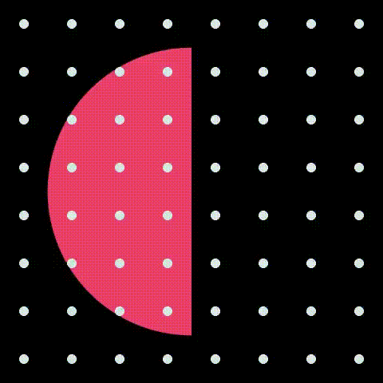
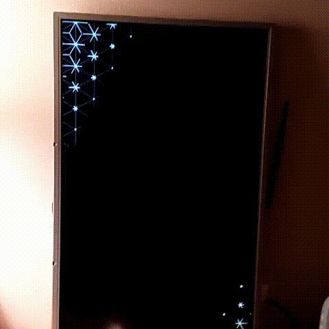

<!-- .slide: data-background="#000000" -->
# What are the chances?

** Patricio Gonzalez Vivo **

*patricio.io* | *@patriciogv*

Note:
Hola, Buenos Dias, Hello, my name is Patricio Gonzalez Vivo.
It's an honor to be here. Big thanks to **Dave, Jer, Wes and Caitlin** for inviting me to share my work today. Also thanks to my wife, **Jen Lowe**, who is my collaborator in all things, including this talk.

[**make sure sound is on**]

I thought I'd start by showing my most embarrassing work on the internet, just to get it out of the way. 

--

<!-- .slide: data-background="#000000" -->
<iframe class="background" data-src="https://player.vimeo.com/video/23659674?title=0&byline=0&portrait=0#t=19" width="1200" height="750" frameborder="0" webkitallowfullscreen mozallowfullscreen allowfullscreen></iframe>

Note:
Ok, that's enough of that.

--

<!-- .slide: data-background="#000000" -->
<!-- <iframe data-src='tangram.html?style=randomCity&animate=true#15/40.7076/-74.0146'></iframe> -->
<iframe data-src='tangram.html?style=tilt-pericoli&animate=true#15/40.7076/-74.0146'></iframe>

Note:
I'm a **developer currently based in New York City working at Mapzen**, where I'm **helping to build a 3D Map engine** and experimenting with **maps & shaders**.

But **7 years ago I was a psychologist and expressive art therapist** in Buenos Aires.

I'm going to talk about the synchronicities that led me here.

--

<!-- .slide: data-background="#8CA28C" -->
<!-- <iframe data-src='https://web.archive.org/web/20100620130219/http://www.arteparasanarte.com.ar/'></iframe> -->

Note:
At the **very end of 2009, I was an expressive art therapist in Buenos Aires building a website for my business**. The site was "arte para sanarte", which is a worldplay meaning "art to heal". I built it in Flash, and thanks to The Wayback Machine, I recovered it here in GIF form : )
This is the second of a few embarrassing things I’m going to show you, but it’s appropriate because **this talk is also going to spiral**. 

--

<!-- .slide: data-background="#FFFFFF" -->

Note:
While I was building my website, I needed to figure out how to work with XML files...
...so I searched for “processing XML,” and in the **first of many synchronicities**, I ended up here...

--

<!-- .slide: data-background="#FFFFFF" -->

Note:
… to a webpage that I’m sure is familiar to a lot of us :)

and it took me a while to understand what was going on on this page... 
that this was a **community of people making ART with CODE**. I felt like I’d tapped into a world of misfits like me, and I wanted to use these tools for expressive art therapy…

--

<!-- .slide: data-background="#000000" -->

Note:
…so let’s spiral back to art therapy for a minute.

The expressive art therapy approach **flows between different artistic languages** like music, painting, sculpture, and dance... to **discover, amplify, and transform emotions and processes in the body**. 

It feels like being in a state of play... but these **non verbal languages allow you to dive very deep**.

**Each different language gives you the ability to express your interior landscape in a different way**. 

--

<!-- .slide: data-background="#000000" -->

Note:
Sculpture is about **letting shape emerge**...

--

<!-- .slide: data-background="#000000" -->

Note:
While painting is more like a **sedimental process where meaning deposits in layers**... one after another...

--

<!-- .slide: data-background="#FFFFFF" -->

Note:
And movement lets you **embody a feeling and transform it** over time.

--

<!-- .slide: data-background="#000000" -->

Lygia Clark

Note:
In South America, we can trace these kinds of activities to the pioneering work of Brazilian artist **Lygia Clark**.

--

<!-- .slide: data-background="#000000" -->

Note:
In the 1970s she created **interactive works that directly involved museum goers in collaborative sensory experiences**. In the late 70s, she shifted from creating artworks to working as an art therapist.

--

<!-- .slide: data-background="#000000" -->

Note:
Expressive art therapy is usually done together **with others**. It is a very **experiential, organic and intense** process...

--

<!-- .slide: data-background="#000000" -->

Note:
often we end up constructing a collective mandala... as a way to tie the individual experience to the group.

--

<!-- .slide: data-background="#FFFFFF" -->

Note:
Because I was already working with all of these expressive languages, when I discovered the Processing community, I was **moved by the use of CODE as an expressive language**.

--

<!-- .slide: data-background="#FFFFFF" -->

Note:
I emailed all the artists I could find who were working in new media, asking them if they knew anyone working in Argentina...

And Chris Sugrue emailed back, introducing me to Diego Alberti... 

I got in touch w Diego, and he suggested that I should apply to interactivos Telefónica. 

(At the time, Telefónica was like the Eyebeam of Buenos Aires.)

--

<!-- .slide: data-background="#000000" -->

Note:
I applied, and here we are in interactivos 2010. I made great friends there, like Tomas Rawski, Joaquin Aras, Javier Bilatz, then Jorge Crowe, Guido Corallo, Leo Solas and Cris Reinaga.

--

<!-- .slide: data-background="#000000" -->

Note:
At that time I was also working as an art therapist with a group of kids at the **CALOS community center**, and that really influenced the project I made at Interactivos...

--

<!-- .slide: data-background="#000000" -->

Note:
...**with the kids in mind, at Interactivos I worked on a collective drawing installation**. I made a device to try to **promote interaction** between people instead of alienation.

But I found that the installation didn't get people to interact in the ways I'd imagined...

Adults were interacting in polite ways, almost afraid to break the table... 

While kids used it to discharge all their energy and anxiety. 

I felt that the **technological feel of the installation had too much gravity** - people interacted much differently with this digital collective mandala than they did when painting a collective mandala on paper.

--

<!-- .slide: data-background="#000000" -->

Note:
**These reflections led me to make my next project**, efecto mariposa (or "the butterfly effect")

I wanted to make a more **sensitive** installation, where **techonology was hidden beneath a more natural interface**.

--

<!-- .slide: data-background="#000000" -->

Note:
The kinect was new back in those days, and I did a realtime **simulation of the different spheres of an ecosystem**, 

--

<!-- .slide: data-background="#000000" -->

Note:
programmed in such a way that the ecosystem suffers if people interact with it in an aggressive way... Then they had to **wait until the system regained balance** to interact with it again.
This forced a **gentle experimentation with the system**.

--

<!-- .slide: data-background="#000000" -->
 <!-- {_class="fragment"} -->
 <!-- {_class="fragment"} -->

Note:
**Another synchronicity** happened while I was making Efecto Mariposa, but to explain it, and to **explain what I mean by synchronicity**, I'm going to **spiral back to psychology**

I'm from Buenos Aires, which, together with Paris and the Upper East Side, is one of the last places in the world where people do Psychoanalysis.

Among Buenos Aires therapist, everyone was into this guy:

FREUD.

But I was into this other guy,

… his archenemy. Carl Gustave Jung.

Like most archenemies, they use to be friends. In fact, Jung was Freud's favorite student. 

--

<!-- .slide: data-background="#000000" -->

Note:
At the begining of the **1900s it was fashionable for psychiatrists to keep dream diaries**. Jung had one where he wrote about and drew his dreams.
Jung was very interested in the mythological content of dreams. 

Freud thought the unconsious content of dreams came from **personal** memories, but Jung believed that the unconscious content came from a place deeper than personal memories... 

Jung believed that every **person's unconscious goes deeper into a collective source of unconscious material**, the **collective unconscious**

--

<!-- .slide: data-background="#FFFFFF" -->

Note:
Jung also used this idea of a collective unconcious to explain **meaningful coincidences** that seem to be connected by more than simple cause and effect.

Like dreaming about an event before it happens... or witnessing something where it seems the "world" is trying to speak with you.

He differentiates this concept from chance, or randomness, by using the word **synchronicity**.

--

<!-- .slide: data-background="#FFFFFF" -->

Note:
It's hard to say CHANCE or RANDOM with out pointing to the work of **Casey Reas**...
Casey in this book, together with his collaborators points to the complexity behind perfect computer random.

For example in **GLSL Shaders, a parallel programing language designed to run in the graphic card, there is not a native function for random**.

--

<!-- .slide: data-background="#000000" -->
<iframe data-src='edit.html?log=160306213426&menu=false&multipleBuffers=false&theme=tomorrow-night-eighties&canvas_size=halfscreen&canvas_snapable=true'></iframe>

Note:

Here is a **recode of 10 PRINT** maze algorithm in to a shader... between lines 14 and 16 you can see how I'm constructing a pseudo random from a sine wave. Not particularly simbolic.

But if I want to **open this random to the Jungiang concept of synchronicity**, I should use more a simbolical source than a sine wave... something that's more **open to the complexity and serendipity of the collective**... like the wind. 

--

<!-- .slide: data-background="#000000" -->
<canvas class='sandbox' data-fragment-url='shaders/10print-wind_dir.frag' data-textures='shaders/data.png' width='500px' height='900px' ></canvas>

<canvas class='sandbox' data-fragment-url='shaders/10print-wind_speed.frag' data-textures='shaders/data.png' width='500px' height='900px' ></canvas>

<canvas class='sandbox' data-fragment-url='shaders/10print-temp.frag' data-textures='shaders/data.png' width='500px' height='900px' ></canvas>

wind direction &nbsp; &nbsp; &nbsp; &nbsp; &nbsp; &nbsp; &nbsp; &nbsp; &nbsp; &nbsp; &nbsp; wind speed &nbsp; &nbsp; &nbsp; &nbsp; &nbsp; &nbsp; &nbsp; &nbsp; &nbsp; &nbsp; temperature

Note:
Here I **modify the previus code to use** last months data of: **wind direction, wind speed and temperature**.
I would like to thing that Jung will like this **gesture**.

--

<!-- .slide: data-background="#000000" -->

Note:
Back to the collective unconcious... Jung was noticing that he was having **recurring vivid nightmares**.

--

<!-- .slide: data-background="#000000" -->

Note:
Nightmares about **floods**. 

--

<!-- .slide: data-background="#000000" -->

Note:
Nightmares about **volcanoes**. 

To the point he worried that he was becoming **schizophrenic**.

He also noticed that many of his patients were having similar nightmares, and he worried that he was somehow **"infecting"** his patients with his own nightmares. 

When **the first World War** started, he found another explanation for the collective nightmares...

--

<!-- .slide: data-background="#000000" -->

"On July 31st, immediately after my lecture,

I learned from the newspapers that 

**war had broken out**.

Finally I understood.

And when I disembarked in Holland on the next day, 

**nobody was happier than I**.

Now I was sure that no schizoprenia was threatening me. 

I understood that **my dreams and my visions came to me from the subsoil of the collective unconscious**."

*C. G. Jung, July 1914*

Note:
Yep... Jung wasn't a great guy... All happy about his discoveries while war breaking out... 

These collective nightmares he was noticing became his **support for the idea of a collective unconscious**.

For him, this nightmares were feed by **the subsoil of the collective unconsious**, tapping in to a future vision that war was coming.

--

<!-- .slide: data-background="#000000" -->

Note:
In **June 2011** (five years ago)...

**after 50 years of lying dormant, and without any notice,**

a volcano in southern Chile called **Puyehue** erupted.

--

<!-- .slide: data-background="#000000" -->

Note:
This eruption ejected around **one hundred million tons of ash, sand and pumice**. 

--

<!-- .slide: data-background="#000000" -->

Note:

--

<!-- .slide: data-background="#000000" -->

Note:
A satellite view.

--

<!-- .slide: data-background="#161616" -->
<!-- <iframe data-src='tangram.html?style=puyehue#6.81187/-37.148/-63.976'></iframe> -->
<iframe data-src='tangram.html?style=puyehue#9.765/-40.6179/-72.0973'></iframe>

Note:
**Wind, embodying chance...**

**moves the volcanic plume handreds of kilometers away.**

**All the way to Buenos Aires**, where I was living.

**WHAT ARE THE CHANCES** that this happen?? right?

The ash brought destruction, 
the airports were closed for weeks,
supermarket shelves emptied.

--

<!-- .slide: data-background="#000000" -->

 <!-- {_class="fragment"} -->
 <!-- {_class="fragment"} -->

Note:
**everything**...

**felt**...

**fragile**.

--

<!-- .slide: data-background="#000000" -->
<iframe data-src="https://player.vimeo.com/video/31940579#t=80" frameborder="0" webkitallowfullscreen mozallowfullscreen allowfullscreen></iframe>

Note:
This eruption happened while I was making efecto mariposa.

I had **planned to use sand for the installation, but instead I used Puyehue's ashes**.

The ashes made the work more significant for those who experienced it, and the eruption **motivated me to tune the algorithms** simulating different layers of the ecosystem to make it **more complex**... and **less linear**... **more temperamental and sensitive to interactions**. 

**The synchronicity of the volcano influenced both the form of the installation and its function**; it **reacted in unexpected ways**.

To make Efecto Mariposa, I had to **learn how to code in GLSL shaders**, in order to do the simulations in realtime.

--

<!-- .slide: data-background="#OOOOOO" -->
<iframe data-src='edit.html?log=160603004045&multipleBuffers=false&menu=false&theme=tomorrow-night-eighties&canvas_size=halfscreen&canvas_snapable=true&canvas_resizable=true'></iframe>

Note:
I absolutely **fell in love** with shaders. 

I love shaders because of their **constraints and simplicity**.

- There are **no libraries**
- only **mathematical functions**
- The input is images... and the **output is images**...

It is **code from the perspective of the pixels**... the **individual elements that compose an image**.

I think of them as similar to **haikus**. All you have to do is **describe an image in a few sentences** of code.

This **forces me to think of algorithms from the perspective of the pixels**... the **atoms**... the **minimal components**.

And I'm not there yet, but I think this simplicity can be an expressive language.

--

<!-- .slide: data-background="#000000" -->

Note:
So anyway, I **grabbed all the layers of simulations I was doing with shaders** for efecto mariposa.

I broke them into **modules**... and put them together into an **openFrameworks addon**.

My first openSource contribution was ofxFX. 

--

Note:
It got very popular and helped others to incorporate shaders into their work.

--

<!-- .slide: data-background="#000000" -->

Note:
Thanks to that addon, I met **Molmol Kuo and Zach Lieberman**.

--

<!-- .slide: data-background="#161616" -->
<iframe data-src='tangram.html?style=bue-nyc#3.8/5.83/-62.89'></iframe>

Note:
And **thanks to Zach, I applied to parsons**, and **moved to NYC** : )

--

<!-- .slide: data-background="#FFFFFF" -->

Note:
**Fast forward two years and in 2014** when I was working on my **thesis**...

I was working on a series of **projects about awareness and the tools we use to see the world around us**.

This machine in particular prints a **large-scale horizon showing the transition between the city and the mountains**.

--

<!-- .slide: data-background="#000000" -->

Note:
To construct a continuous horizon I was scraping google street view data.

--

<!-- .slide: data-background="#000000" -->

Note:
Finding ways to **stitch the panoramic images** together.

--

<!-- .slide: data-background="#000000" -->

Note:
Then I found this depthmap data in their API

--

<!-- .slide: data-background="#000000" -->

Note:
Having z allows me to add up point clouds.

--

<!-- .slide: data-background="#000000" -->

Note:
The results were for me like **inventing photography** again...

--

<!-- .slide: data-background="#000000" -->

Note:
I have to **choose a location, put my camera in focus**, and **then wait for the calls to come back from the server with points of light**.

--

<!-- .slide: data-background="#000000" -->

Note:
These **images of public spaces emerged slowly from the depth of a private database**.

--

<!-- .slide: data-background="#000000" -->

Note:
I worked with the style until I felt the results were **honest about the nature of the process**.

--

<!-- .slide: data-background="#000000" -->

--

<!-- .slide: data-background="#FFFFFF" -->
<iframe data-src='http://patriciogonzalezvivo.com/2014/skylines/queensboro/'></iframe>

Note:
[interact with it... show arround]

I tried to prepare some new point clouds for this talk, and found that **Google's changed their API**.

--

<!-- .slide: data-background="#FFFFFF" -->

Note:
So **sometime since 2014, Google made these images into limited editions**. 

--

<!-- .slide: data-background="#FFFFFF" -->

Note:

--

<!-- .slide: data-background="#FFFFFF" -->

Note:
**This is an intrinsic fragility in working with proprietary tools**.

--

<!-- .slide: data-background="#FFFFFF" -->

Note:

--

<!-- .slide: data-background="#1D1D1D" -->
<iframe data-src="tangram.html?style=tilt-gotham-orig#16/40.7076/-74.0146"></iframe>

Note:
**At Mapzen we work with open standards**... 

**using community created and mantained data**... like openStreetMap data...

**Everything we do is open source**

--

<!-- .slide: data-background="#FFFFFF" -->

note:
I have the **privilege of working with a stellar line up of some of the best professionals in the field**, doing what I love the most... shaders.

--

<!-- .slide: data-background="#FFFFFF" -->

Note:
Our experiments are done in the open 

--

<!-- .slide: data-background="#FFFFFF" -->
<a href='https://mapzen.com/blog/point-clouds'>
   
Experiment on LIDAR + SfM + OpenStreetMap (Python/C++)
</a>

Note:

--

<!-- .slide: data-background="#FFFFFF" -->

Note:
**Pushing the limits**

--

<!-- .slide: data-background="#000000" -->

Note:
**Of what can be done with maps**

--

<!-- .slide: data-background="#020303" -->

Line of Sight

Note:
**Using open data**

(This project **shows all the satellites overhead** at a given moment.)

Also working with open source helps build community. 

--

<!-- .slide: data-background="#FFFFFF" -->

**Weili** Shi (@shiweili)

Note:
these are some projects made using mapzen's tools.

--

<!-- .slide: data-background="#FFFFFF" -->

**Tyler** Green (@greent_tyler)

Note:

--

<!-- .slide: data-background="#000000" -->

Note:
how much of **the community in this room** exists because of **processing and this book**?

--

<!-- .slide: data-background="#FFFFFF" -->

Note:
**This relationship between openness and community**... 

**is a solution to fragility**.

**That's why I wrote The Book of Shaders, together with my wife Jen**...

--

<!-- .slide: data-background="#FFFFFF" -->

Note:
So other people don't need to **replicate my difficult and esoteric process of teach-yourself-shaders**.

--

<!-- .slide: data-background="#FFFFFF" -->
 

 

Note:
this is work from my **students at parsons**

--

<!-- .slide: data-background="#FFFFFF" -->
 

 

**Kenichi** Yoneda (@kyndinfo)

Note:
This is some work of Kenichi Yoneda... which is one of the mayor contributors to the book.

--

<!-- .slide: data-background="#FFFFFF" -->
 

 

**Joseph** Fiola (@vjzef)

Note:
Joseph Fiola. How use this patterns 

--

<!-- .slide: data-background="#000000" -->

**Joseph** Fiola (@vjzef)

Note:
on his VJ performance.
This happen in the begining of this year in Montreal 

--

<!-- .slide: data-background="#FFFFFF" -->
<iframe data-src="http://thebookofshaders.com/log/?index=0&jump=200"></iframe>

Note:
Like this artist, **ppl are using the book's editor everyday**. 

I like to enter here every day and see new things appear.

--

<!-- .slide: data-background="#FFFFFF" -->
<iframe data-src='tangram.html?style=collaborators#3/20/10'></iframe>

Note:
These are some of the **people who have joined this project**, donating time and effort to help others learn.

I'm just so **thankful** to them.

They've **translated the book of shaders to Japanese, Korean, Spanish and French**. The Italian translation is on the way.

Also talking to them is bringing new voices to the project. I have this feeling that the book is starting to have a life of its own.

--

<!-- .slide: data-background="#FFFFFF" -->
<iframe data-src='http://thebookofshaders.com/06'></iframe>

Note:
So **along with writing the teaching metaphors**, I found my self **developing tools** for the book.

The **embedded live coding editor is crucial**. It **decreases the distance** from reading of a concept to trying it in code.

Also the little helpers to tweak and change variables are very helpful to **make abstract concept more tangible**. 

For example a **vec3 can be a color, a position or direction**. This concept are **interchangeable in the shader**. **Because shaders are basically mathematical functions and vectors have that plasticity**.

--

<!-- .slide: data-background="#000000" -->
   

  

Note:
Lately I've been **writing shaders for an openFrame I made from a raspberryPi and some garbage** in my apartment basement

--

<!-- .slide: data-background="#000000" -->

Note:

--

<!-- .slide: data-background="#000000" -->
   

  

Note:
I've been **enjoying the challenge of making shaders harmonious enough** to live in my house, and I've **spiraled back around to mandalas**, my old friends from art therapy.

--

<!-- .slide: data-background="#FFFFFF" -->

 <!-- {_class="fragment"} -->
 <!-- {_class="fragment"} -->

Note:
**"Mandala" refers loosely to any symbolic circular form that refers to “the whole”**. 

**We can find them in all major religions**. 

[double press here]

:)

--

<!-- .slide: data-background="#FFFFFF" -->

Note:
**Jung's diagram of the psychic structure**, including the collective unconscious. Note how he **deliberately made it look like a mandala**.

--

<!-- .slide: data-background="#000000" -->

Note:
**Traditional Tibetan Buddhist mandalas are made from grains of sand**.

--

<!-- .slide: data-background="#000000" -->
<iframe data-src="https://www.youtube.com/embed/LcJWazzEUKk?start=110&amp;autoplay=1" frameborder="0" allowfullscreen></iframe>

Note:
They are **ritualistically created and destroyed**.

This seems like a **practice of fragility**.

--

<!-- .slide: data-background="#000000" -->

Note:
Remember Jung's flood nightmares that came from the collective unconscious?

--

<!-- .slide: data-background="#000000" -->
"**I saw a terrible flood** that covered all the northen and low-lying lands between the North Sea and the Alps. It reached from England up to Russia, and from the coast of the North Sea right up to the Alps. I saw yellow waves, swimming rubble and the death of countless thousands... Two weeks passed then the visions returned, still more violent than before and an inner voice spoke: 

Look at it, it is completely real, and it will come to pass. You cannot doubt this."

*C. G. Jung, October 1913*

Note:
**Jung's description** of the flood nightmares.

--

<!-- .slide: data-background="#000000" -->

Note:
**Visions of flooding are already happening in worldwide**, and scientists have predicted from about 0.5 meter to 1.5 meter sea level rise by 2100. 

These are **fragile times**.

--

Rio de Janeiro
<!-- .slide: data-background="#000000" -->

Note:

This is rio, a paradise on earth

--

Rio de Janeiro
<!-- .slide: data-background="#000000" -->

<iframe class='background'  data-src='tangram.html?style=emerge#14.83106/-22.9731/-43.1661'></iframe>

Note:

**At Mapzen, we are working in this is a visualization of sea level rising**.
It is made with our **VectorTiles** (made from OpenStreetMap data) together with our **new elevation raster tiles**.

**Combined it's possible to construct a terrain with world coverage** and see **what areas are affected by the sea level rising**.

Althought sea-level-rise **estimates disagree**, and it's hard to find consensus on papers, this map will be useful to **help with the communication arround climate change**.

--

<!-- .slide: data-background="#000000" -->
 

SFC &nbsp; &nbsp; &nbsp; &nbsp; &nbsp; &nbsp; &nbsp; &nbsp; &nbsp; &nbsp; &nbsp; &nbsp; &nbsp; &nbsp; &nbsp; &nbsp; &nbsp; &nbsp; &nbsp; &nbsp; &nbsp; &nbsp; &nbsp; &nbsp; &nbsp; &nbsp; &nbsp; &nbsp; &nbsp; &nbsp; &nbsp; &nbsp; NYC

Note:

Like efecto mariposa this are images of **fragil and complex system fighting for balance**...

**reacting non linearly... temperamentally... unpredictably**

--

<!-- .slide: data-background="#000000" -->
<iframe data-src='edit.html?log=160601142223&menu=false&multipleBuffers=false&theme=tomorrow-night-eighties&canvas_size=halfscreen&canvas_snapable=true' ></iframe>

Note:
I found in the **ephimeral nature of mandalas, the harmony to accept fragility**...

To be **gentle and listen the flow**...

To be **open to others and the whole**...

I find **refuge in synchronicity**, in the fact that doing an internet search for XML 6 and a half years ago would lead me here:

--

<!-- .slide: data-background="#000000" -->
<iframe data-src='tangram.html?style=tilt-ikeda-orig#16/40.7076/-74.0146' ></iframe>

Note:

[pause]

Looking back...

--

<!-- .slide: data-background="#000000" -->
<iframe data-src='http://player.thebookofshaders.com/?log=160601151757' ></iframe>

Note:
Synchronicity invites me to new york, 

to be in Zach's class...

that lead me to this moment

--

<!-- .slide: data-background="#000000" -->

Note:
[pause]

--

<!-- .slide: data-background="#000000" -->
<iframe data-src='http://player.thebookofshaders.com/?log=160601150024'></iframe>

Note:
Also lead me to work in the open...
which lead me here today with you.

--

<!-- .slide: data-background="#000000" -->
<iframe data-src='tangram.html?style=all#3/20/10'></iframe>

Note:
**Thanks to every person and every event that interweave a path, a network, a home a family**... with me

---

<!-- .slide: data-background="#000000" -->
**patriciogonzalezvivo**.github.io/**eyeo16**

---

<!-- .slide: data-background="#FFFFFF" -->

## Thank you all

[patricio.io](http://patricio.io) | [@patriciogv](https://twitter.com/patriciogv)

Note:

Thanks you
