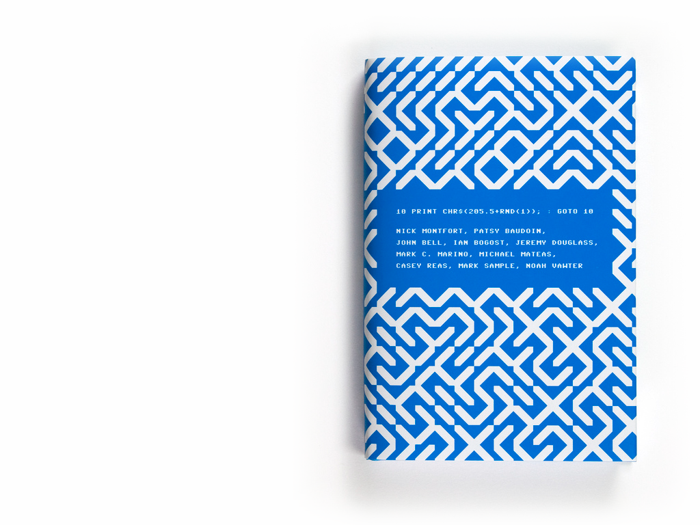

<!-- .slide: data-background="#000000" -->
# What are the chances?

** Patricio Gonzalez Vivo **

*patricio.io* | *@patriciogv*

Note:
Hello my name is Patricio Gonzalez Vivo.
It's an honor been here... Thanks the organizer and Jen
break the ice by showing something embarazing 

--

<!-- .slide: data-background="#000000" -->
<iframe src="https://player.vimeo.com/video/23659674?title=0&byline=0&portrait=0" width="1200" height="750" frameborder="0" webkitallowfullscreen mozallowfullscreen allowfullscreen></iframe>

Note:

--

<!-- .slide: data-background="#000000" -->
<iframe data-src='tangram.html?style=randomCity&animate=true#15/40.7076/-74.0146'></iframe>

Note:
I'm a developer currently based on NY working on mapzen building a 3D Map engine and experimenting with maps & shaders.
But 7 year ago I was a psychologist and expressive art therapist in Buenos Aires.
I'm going to talk about the synchronicities that led me here.

--

<!-- .slide: data-background="#91AC99" -->
<!-- <iframe data-src='https://web.archive.org/web/20100620130219/http://www.arteparasanarte.com.ar/'></iframe> -->

Note:
So at the very end of 2009, I was an expressive art therapist in Buenos Aires building a website for my bussines. The site was "arte para sanarte", which is a worldplay meaning "art to heal". I build it in Flash, and thanks to The Wayback Machine, I could recovery in GIF form : )
This is the second of MANY embarrassing things I’m going to show you, but it’s appropriate because this talk is going to be something of a spiral 

--

<!-- .slide: data-background="#FFFFFF" -->

Note:
While I was building my site, I needed to figure out how to work with XML files, so I searched for “processing XML,” and in the first of many synchronicities, I ended up here:

--

<!-- .slide: data-background="#FFFFFF" -->

Note:
… to a webpage that I’m sure is familiar to a lot of us :)

and it took me a while to understand what was going on here… that this was a community of people making ART with CODE. I felt like I’d tapped into a world of misfits like me; I wanted to use these tools for expressive arts therapy…

--

<!-- .slide: data-background="#000000" -->

Note:
…so let’s spiral back to arts therapy for a minute

--

<!-- .slide: data-background="#000000" -->

--

<!-- .slide: data-background="#000000" -->

--

<!-- .slide: data-background="#000000" -->

--

<!-- .slide: data-background="#000000" -->

--

<!-- .slide: data-background="#FFFFFF" -->

--

<!-- .slide: data-background="#000000" -->

Lygia Clark

Note:
Elder

--

<!-- .slide: data-background="#000000" -->

--

<!-- .slide: data-background="#FFFFFF" -->

--

<!-- .slide: data-background="#000000" -->

--

<!-- .slide: data-background="#000000" -->

--

<!-- .slide: data-background="#000000" -->

Note:
ritual around device that produces interaction between people and not alienation; technology has too much gravity - way kids and adults were interacting -> led to efecto mariposa - sensitive; natural; reacts badly if you interact with it in an aggressive way

--

<!-- .slide: data-background="#000000" -->

Note:
Efecto mariposa

--

<!-- .slide: data-background="#000000" -->

 <!-- {_class="fragment"} -->

Note:
…back to psychology

--

<!-- .slide: data-background="#000000" -->

Note:
Jung's dream drawings 

--

<!-- .slide: data-background="#000000" -->
maybe some jung quotes?

--

<!-- .slide: data-background="#FFFFFF" -->

Note:
while we tend to work v hard to get a “pure” random in our code, Jung [something something] synchronicity

--

<!-- .slide: data-background="#000000" -->
<iframe data-src='edit.html?log=160306213426&menu=false&multipleBuffers=false&theme=tomorrow-night-eighties&canvas_size=halfscreen&canvas_snapable=true'></iframe>

Note:
So I recode the famous 10 Print.

--

<!-- .slide: data-background="#FFFFFF" -->
<iframe data-src='graph.html'></iframe>

Note:
Shaders don't have random native function... this is how is constructed

--

<!-- .slide: data-background="#14131A" -->
<iframe data-src="http://tangrams.github.io/WeatherOverTime/"></iframe>

Note:
Weather project

--

<!-- .slide: data-background="#000000" -->

Note:
Storing data into this image.

--

<!-- .slide: data-background="#000000" -->
<canvas class='sandbox' data-fragment-url='shaders/10print-wind_dir.frag' data-textures='shaders/data.png' width='500px' height='900px' ></canvas>

<canvas class='sandbox' data-fragment-url='shaders/10print-wind_speed.frag' data-textures='shaders/data.png' width='500px' height='900px' ></canvas>

<canvas class='sandbox' data-fragment-url='shaders/10print-temp.frag' data-textures='shaders/data.png' width='500px' height='900px' ></canvas>

wind direction &nbsp; &nbsp; &nbsp; &nbsp; &nbsp; &nbsp; &nbsp; &nbsp; &nbsp; &nbsp; &nbsp; wind speed &nbsp; &nbsp; &nbsp; &nbsp; &nbsp; &nbsp; &nbsp; &nbsp; &nbsp; &nbsp; temperature

Note:
Jung might approve of a random created from real data, like wind speed, direction, or temperature

--

<!-- .slide: data-background="#000000" -->
back to collective unconscious 

Note:
Back to the collective unconcious
reminder collective unconscious -> nightmares -> WWI

--

<!-- .slide: data-background="#000000" -->

Note:
floods

--

<!-- .slide: data-background="#000000" -->
…or [insert other common jung nightmare pic here]

--

<!-- .slide: data-background="#000000" -->

Note:
volcanos

--

<!-- .slide: data-background="#000000" -->

--

<!-- .slide: data-background="#000000" -->

--

<!-- .slide: data-background="#000000" -->

--

<!-- .slide: data-background="#161616" -->
<iframe data-src='tangram.html?style=puyehue#6.81187/-37.148/-63.976'></iframe>

--

<!-- .slide: data-background="#000000" -->

 <!-- {_class="fragment"} -->
 <!-- {_class="fragment"} -->

Note:
… everything… felt… fragile.

--

<!-- .slide: data-background="#000000" -->
<iframe src="https://player.vimeo.com/video/31940579" frameborder="0" webkitallowfullscreen mozallowfullscreen allowfullscreen></iframe>

Note:
more efecto mariposa
used ashes; community; interaction; learning how to build; learning the rules of the system?

--

<!-- .slide: data-background="#000000" -->
maybe more effect mariposa?

--

<!-- .slide: data-background="#000000" -->

Note:
…sea levels rising; already happening in places like bangladesh and [insert island countries that are disappearing]

--

<!-- .slide: data-background="#000000" -->
<iframe data-src='tangram.html?style=emerge#15.3023/-22.9476/-43.1791'></iframe>

Note:
talk about this. flood terrain map

from here I’m going to stay technical for a while and talk about how I came to make this map, and that comes down to Mapzen and [insert other open data / open source here???] and shaders

--

<!-- .slide: data-background="#FFFFFF" -->

note:
talk about the team that i get to work with every day

--

<!-- .slide: data-background="#000000" -->

Note:
open sourcing the efecto mariposa shaders

--

--

<!-- .slide: data-background="#000000" -->

Note:
zach

--

<!-- .slide: data-background="#161616" -->
<iframe data-src='tangram.html?style=bue-nyc#3.8/5.83/-62.89'></iframe>

--

<!-- .slide: data-background="#000000" -->
  
  

--

<!-- .slide: data-background="#FFFFFF" -->

--

<!-- .slide: data-background="#000000" -->

--

<!-- .slide: data-background="#000000" -->

--

<!-- .slide: data-background="#000000" -->

--

<!-- .slide: data-background="#000000" -->

--

<!-- .slide: data-background="#000000" -->

--

<!-- .slide: data-background="#000000" -->

<!-- .slide: data-background="#000000" -->
<!-- <iframe class='fit' width='100%' height='100%' style='min-height: 1400px; position: absolute; top: 0px; right: 0px;' data-src='http://patriciogonzalezvivo.com/2014/pointcloudcity/wash-sq/'></iframe> -->
<!-- <iframe src="https://player.vimeo.com/video/89982874" width="1280" height="800" frameborder="0" webkitallowfullscreen mozallowfullscreen allowfullscreen></iframe> -->

--

<!-- .slide: data-background="#FFFFFF" -->

--

<!-- .slide: data-background="#FFFFFF" -->

--

<!-- .slide: data-background="#FFFFFF" -->
<iframe class='fit' width='100%' height='100%' style='min-height: 1400px; position: absolute; top: 0px; right: 0px;' data-src='http://patriciogonzalezvivo.com/2014/skylines/queensboro/'></iframe>

--

<!-- .slide: data-background="#FFFFFF" -->

--

<!-- .slide: data-background="#FFFFFF" -->

--

<!-- .slide: data-background="#FFFFFF" -->

--

<!-- .slide: data-background="#FFFFFF" -->
 

[Experiments on **3D Labels** (C++)](https://vimeo.com/107190391)

--

<!-- .slide: data-background="#FFFFFF" -->
   

[Experiment on LIDAR + SfM + OpenStreetMap (Python/C++)](https://mapzen.com/blog/point-clouds)

--

 

 

[Tangram styles (WebGL)](patriciogonzalezvivo.github.io/tangram-sandbox/)

--

<!-- .slide: data-background="#000000" -->

 

 

*Tangram styles*

--

<!-- .slide: data-background="#1D1D1D" -->
<iframe class='fit' width="100%" height="100%" style='min-height: 1000px;' data-src="tangram.html?style=tilt-gotham-orig#15/40.7076/-74.0146"></iframe>

2015 - *RandomCity*

--

<!-- .slide: data-background="#020303" -->

  

*Line of Sight*

--

<!-- .slide: data-background="#020303" -->
<iframe class='fit' width="100%" height="100%" style='min-height: 1000px;' data-src="http://patriciogonzalezvivo.github.io/LineOfSight/"></iframe>

*LineOfSight*

--

**Geraldine** Sarmiento (@sensescape)

--

**Weili** Shi (@shiweili)

---

---

--

--

--

--

<iframe class='fit' width='100%' height='1000px' data-src='http://thebookofshaders.com/05'></iframe>

--

<!-- .slide: data-background="#272822" -->
<iframe class='fit' width='100%' height='1000px' data-src='edit.html?multipleBuffers=false'></iframe>

--

<iframe class='fit' width='100%' height='100%' style='min-height: 1000px;' data-src='tangram.html?style=collaborators#3/20/10'></iframe>

--

--

--

 <!-- {_class="fragment"} -->
 <!-- {_class="fragment"} -->

--

<!-- .slide: data-background="#000000" -->

--

<!-- .slide: data-background="#000000" -->
<iframe width="853" height="480" src="https://www.youtube.com/embed/LcJWazzEUKk" frameborder="0" allowfullscreen></iframe>

---

**[o]** openFrame.io 

*by Ishac Bertran (@ishacbertran) & Jon Whol (@jonwohl)*

--

<!-- .slide: data-background="#000000" -->

--

<!-- .slide: data-background="#000000" -->
<iframe src="https://vine.co/v/ixunMhF10EF/embed/simple" width="400" height="400" frameborder="0"></iframe><iframe src="https://vine.co/v/ixun5zIu2eq/embed/simple" width="400" height="400" frameborder="0"></iframe>
<iframe src="https://vine.co/v/iQZF2WdzWit/embed/simple" width="400" height="400" frameborder="0"></iframe><iframe src="https://vine.co/v/i0HIuixHxTv/embed/simple" width="400" height="400" frameborder="0"></iframe>

--

<!-- .slide: data-background="#000000" -->
<iframe class='fit' width='100%' height='100%' style='min-height: 800px;' data-src='edit.html?log=160519125734&menu=false&multipleBuffers=false&theme=tomorrow-night-eighties&canvas_size=halfscreen&canvas_snapable=true'></iframe>

--

<!-- .slide: data-background="#000000" -->
<iframe class='fit' width='100%' height='100%' style='min-height: 800px;' data-src='edit.html?log=160302101618&menu=false&multipleBuffers=false&theme=tomorrow-night-eighties&canvas_size=halfscreen&canvas_snapable=true'></iframe>

--

<!-- .slide: data-background="#000000" -->
<iframe class='fit' width='100%' height='100%' style='min-height: 800px;' data-src='http://player.thebookofshaders.com/?log=160304203331'></iframe>

--

<!-- .slide: data-background="#000000" -->
<iframe class='fit' width='100%' height='100%' style='min-height: 800px;' data-src='http://player.thebookofshaders.com/?log=160313030533'></iframe>

--

<!-- .slide: data-background="#000000" -->
<iframe class='fit' width='100%' height='100%' style='min-height: 800px;' data-src='http://player.thebookofshaders.com/?log=160510011212'></iframe>

--

<!-- .slide: data-background="#000000" -->
<iframe class='fit' width='100%' height='100%' style='min-height: 800px;' data-src='http://player.thebookofshaders.com/?log=160301005406'></iframe>

--

<iframe class='fit' width='100%' height='100%' style='min-height: 800px;' data-src='http://player.thebookofshaders.com/?log=160503001527'></iframe>

--

<!-- .slide: data-background="#000000" -->
<iframe class='fit' width='100%' height='100%' style='min-height: 800px;' data-src='http://player.thebookofshaders.com/?log=160523135652'></iframe>

--

[BIG MAP OF all the people that helps me]

---

## Thank you all

[patricio.io](http://patricio.io) | [@patriciogv](https://twitter.com/patriciogv)

--

[**patriciogonzalezvivo**.github.io/**eyeo16**](http://patriciogonzalezvivo.github.io/eyeo16/)

Note:
here you can find this presentation.
