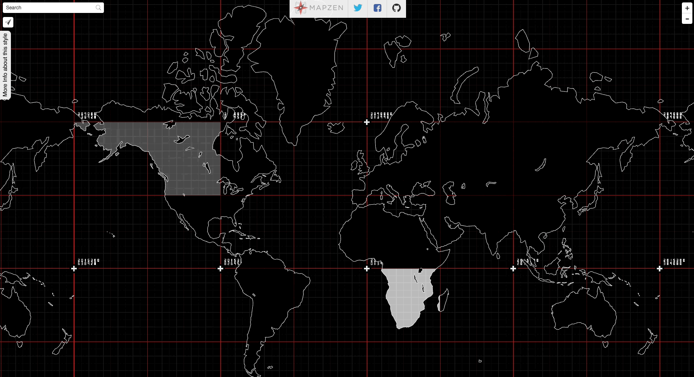

<!-- .slide: data-background="#000000" -->


---

DEC 2009

Note:
Dic 2009, starting the annoying/imposible process of making your own website. I was working as Clinical Psychologist and Expressive art Therapist in that time.
I was teaching my self flash to make my own website for my practice as an art therapist. Googling around I search for “processing XML”

--


Note:
Which lead me to processing documentation (made by Scott Murray??)

--


Note:
The discovery was FASCINATING. This people were combining arts with computer code.
In my world at that moment I was a misfit.

Beside the fact that I always have been a nerd that like computers. Buenos Aires, is together with Paris and Upper West Side in Manhattan, one of the last places where people do (and like) Psychoanalyst.

So while everybody in school was into this guy:

--


Note:
was a fan of this other guy.

--


Note:
… his archenemy, Carl Gustave Jung.

(he actually looks like my grand father)

Like most archenemies, they use to be friends. Jung was the favorite disciple. Freud name him his sucesor and put him in charge of the International Psychoanalytical Association.

--


Note:
They disagree on the origin of libido and in the scope of unconscious. Freud, father of this ideas, thought the libido was just sexual, and the unconscious made of personal memories.

Jung disagree that the libido was only a sexual. He also believed that deeper than the personal unconscious was a bast collective ocean of shared psychological content. Not just instincts but a whole set of psychological structures, he later call archetypes. They manifest in mythological themes, images, patterns visible along generations and around the world.

--


Note:
For him the personal psique emerge from this collective sea

--


Note:
I was in love with this ideas, to the point that I did a post degree in Jung and the use of art as a way to pull content from this deep ocean. To amplify meaning thought the use of different expressive languages.

Is funny because each different language have the ability to think and said things in different ways. Movement for example, it fluctuates over time... was this ability to transform things.... you enter into an activity with an emotion and thought dance you can move it, transform it into something else....  Painting is more like a sedimental process... you bring something and you put it on paper... then you add more and more stuff... an image slowly appears over time. 

So I was there looking to all this hybrid artist using code as a language. I was intrigue  about what the uses of this as an expressive language. What could be said with technology that could be said in another way.

I send emails to all the artist could found. 

MAP OF THE WORLD???

I only reply

--


Note:
... Chiss Sugrue.
I use Dan Shiffman books to learn processing

--


Note:
And I found a great group of artist that soon become my friends. 

--


Interactivos 2010

Note:
Most beautiful things are un expected

Jung have a interesting concept call **synchronicity**
On his work he notice that In his diaries, what later become the red book….

---

<!-- .slide: data-background="#000000" -->


Note:
… he wrote a series of apocalyptic dreams he had. He was concern of his own mental health. But then he start hearing similar dreams by some of his patients.  He was conflicted with the fact that maybe he was some how influencing them.

--

<!-- .slide: data-background="#000000" -->


Note:
When the first world war start was clear for him that actually everybody was have been feeling something coming... In the same way animals feels natural disasters before they happen... There was something in there air that was pict subconsciously by him and his patient..

Because this events didn't directly respond to a cause and effect relation. He call them acausal events. And he thought they could be explain because  of the collective incouncius

In June 2011  (five years ago)...
without any notice....
and after 50 years of lying dormant a volcano at the south of Chille call Puyehue made eruption.

--

<!-- .slide: data-background="#000000" -->


JUN 2011

--

<!-- .slide: data-background="#000000" -->


Note:
This eruption ejected around one hundred million tons of ash, sand and pumice. 

--

<!-- .slide: data-background="#000000" -->


Note:
This eruption ejected around one hundred million tons of ash, sand and pumice. 

--

<!-- .slide: data-background="#000000" -->


Note:
Days after, the plume travels all the way to Buenos Aires. 

--

<!-- .slide: data-background="#161616" -->
<iframe class='fit' width='100%' height='100%' style='min-height: 1000px;' data-src='tangram.html?style=puyehue#6.81187/-37.148/-63.976'></iframe>

Note:
In it path..

--

<!-- .slide: data-background="#000000" -->


Note:
the ashes bring destruction.
- all flights cancel across the southern half of the continent

--

<!-- .slide: data-background="#000000" -->


Note:
- Nilahue River went up to 113° and killed around 4.5 million fishes
- heart attacks and got throat cancer on the livestock
- fluoride intoxication in sheep, cattle and horses

--

<!-- .slide: data-background="#000000" -->


Note:
- bring five years of drought on Chubut and Rio Negro
This incredible force of nature brings a lot of destructions on it's way

--

<!-- .slide: data-background="#000000" -->
<iframe src="https://player.vimeo.com/video/31940579" class='fit' width='100%' height='1000px' frameborder="0" webkitallowfullscreen mozallowfullscreen allowfullscreen></iframe>

Note:
During the volcano I was working on a project that use kinect camera to do a projection mapping of a ecosystem simulation over a sandbox. My goal was to invite user to interact with it, and by that bring destruction that will take some time to heal and go back to homeostasis. The scale of the volcano eruption had a great influence in this peace. I replace the sand by volcanic ashes, and work hard on it to make the algorithms as complex and realistic as I could. For that I had to learn shaders. It wasn't easy, but at the end was very satisfying to see that the people interacting with it. I like to think that something of what we experience that year could be re experienced in this particular way. In order to think it in a different and healing way.

--

<!-- .slide: data-background="#000000" -->


**Efecto Mariposa** (Butterfly effect)

Note:
There is something that give us pleasure of having the illusion of controlling chaos and chance. Even when we see that the repercussions of our interactions scape our perception of understanding... we find confort in the illusion of control.

--

<!-- .slide: data-background="#000000" -->
<iframe src="https://player.vimeo.com/video/30684308?loop=1&title=0&byline=0&portrait=0" width="640" height="478" frameborder="0" webkitallowfullscreen mozallowfullscreen allowfullscreen></iframe>
<iframe src="https://player.vimeo.com/video/29896245?loop=1&title=0&byline=0&portrait=0" width="640" height="480" frameborder="0" webkitallowfullscreen mozallowfullscreen allowfullscreen></iframe>
<p> + </p>
<iframe src="https://player.vimeo.com/video/29894099?loop=1&title=0&byline=0&portrait=0" width="640" height="480" frameborder="0" webkitallowfullscreen mozallowfullscreen allowfullscreen></iframe>
<iframe src="https://player.vimeo.com/video/29887776?loop=1&title=0&byline=0&portrait=0" width="640" height="480" frameborder="0" webkitallowfullscreen mozallowfullscreen allowfullscreen></iframe>

Note:
Efecto Mariposa was made using openFrameworks.
After this work was expose I start thinking on how to give back. On what could be the best way to open source this work. As a tool. 
Open Source it into an OF addon: ofFX

--


Note:
thanks to that I meet Zack Liberman...

--


Note: he was the one that suggest applying to the master in design and technology at parsons... which I did... 

--

<!-- .slide: data-background="#161616" -->
<iframe class='fit' width='100%' height='100%' style='min-height: 1000px;' data-src='tangram.html?style=bue-nyc#3.8/5.83/-62.89'></iframe>

Note:
and I got to come to NYC.

--

<!-- .slide: data-background="#000000" -->
  
  

Visual Systems for CLOUDS Documentary

Note:
While I was working on the visual system on CLOUDS w James and Jonathan...

--

<!-- .slide: data-background="#000000" -->
<iframe class='fit' src="https://www.google.com/maps/embed?pb=!1m0!3m2!1sen!2sus!4v1463075256574!6m8!1m7!1sp1dCLliwGRUAAAQZDaBD0w!2m2!1d40.72371832370289!2d-73.95171632224185!3f44.320821265143294!4f-15.56789776591117!5f0.7820865974627469" width="100%" height="1000" frameborder="0" style="border:0" allowfullscreen></iframe>

Note:
I meet Jen in this coorner on Green point.
I can trace all back this random events after the volcano.

--

<!-- .slide: data-background="#000000" -->


 <!-- {_class="fragment"} -->

Note:
She was speaking that year. So suddently eyeo become like a honey moon vacations.
In my memory Miniapolis is more romantic that Paris and veneces... together.
Is the american city of love.

Look that face of happines :)

So...

---

<!-- .slide: data-background="#000000" -->
MAR 2014

Note:
But is not just that randoms happens. Is about been open (and probably harder, staying open) to dance with it. 

While working on my Thesis

--


[**Skyline I**](http://patriciogonzalezvivo.com/2014/skylines/skylines.php?v=01)

Note:
series of projects is about awareness... the tools and techniques we use to see the world around us.

--


[**Skyline II**](http://patriciogonzalezvivo.com/2014/skylines/skylines.php?v=02)

Note:
This is a machine that prints the large-scale transitions of the horizon on a path from the city to the mountains. While Skyline #01 sees through the flow of the time, Skyline #02 expands our perception of space.

--

<!-- .slide: data-background="#000000" -->


Note:
For this project I was scrapping google street view data to construct this continues horizon.
You can see how using google's routing service I choose a path, to then make different request to the GoogleStreetView API

--

<!-- .slide: data-background="#000000" -->


Note:
I wasn't completely happy on how this look so I was trying some other things.
I was trying to put this "bubles" togther and put a camera go from one to the other... 
but was basically going trough this wall meshes... kind of disaster. Hulking out the virtual streets

--

<!-- .slide: data-background="#000000" -->


Note:
Then I found this... there was some low definition depth data that could be accesss throught the API

--

<!-- .slide: data-background="#000000" -->


Note:
And now we have some Z. At this point I was: "well, I worked on CLOUDS, I can only use the vertex points and get away with it".

--

<!-- .slide: data-background="#000000" -->


Note:
So I was trying this things before going to bed... adding up this spheres of points... not really sure What It and Jen pass by and she said to me... "That's cool you should tweet about it"

--

<!-- .slide: data-background="#000000" -->


--


Note:
I start pullishing

--


Note:
until start making sense for me.

--


Note:
in lot of things it was like the begining of photography.

--


Note:
I put my camera some where... and then set a robot to retrive this points of information from googles evil servers.

--


Note:
I had to wait this digital landscapes reviel. develop over time.

In that time, I didn't knew it... but I'm preatty sure this got me my actual job 

--


Note:
... at Mapzen. I was showing this work to my actual boss. And He was very excited to bring this kind of exploratory creative work to the mapping world. 
I understood my position as a sort of inhouse R&D possition.

--


Note:
On august 2014, I join the stellar team of Mapzen.
I had to say that is a priviledge of a life time to work with such an amazing line up of profesionals.

--

 

[Experiments on **3D Labels** (C++)](https://vimeo.com/107190391)

Note:
this 3D labels and way finding prototype

--

   

[Experiment on LIDAR + SfM + OpenStreetMap (Python/C++)](https://mapzen.com/blog/point-clouds)

Note:
or this experiment about mixing LIDAR data with Structure from Motion point clouds from images with openStreetMap data.

--

 

 

[Tangram styles (WebGL)](patriciogonzalezvivo.github.io/tangram-sandbox/)

Note:
And then doing cross plaform implementations on Tangram our 2D/3D map engine. At the same time I push the limites of it with doing some maps.

--

 

 

<!-- .slide: data-background="#000000" -->
*Tangram styles (WebGL)*

--

 

 

<!-- .slide: data-background="#000000" -->
*Tangram styles (WebGL)*

--

<!-- .slide: data-background="#020303" -->


  

*Line of Sight*

--


*Terrarium experiments*

--


*Terrarium experiments*

Note:
Having a stable corporate job, was new to me so It didn't take longer to wanting to have my own personal work. 
Something I could do in my free time.

---

JAN 2015

--


Note:
I remember how hard was to learn shaders at the begining and how helpfull have been to know about them.
Something to bring back to the community of developers, art and design, that give me so much.
I decide to start a book that helps artist to learn and use Shaders.

--


--


--


--


Note:
The book had open oportunities for new collaborations

--

<iframe class='fit' width='100%' height='100%' style='min-height: 1000px;' data-src='tangram.html?style=collaborators#3/20/10'></iframe>

Note:
Beside Jen Lowe that had done all the editing of the book
Other people join in the project, voluntering their time and energy.

- Kenichi Yoneda @kyindinfo
- Sawako
- Tong Li 
- Yi Zhang 
- Jae Hyun Yoo 
- Nicolas Barradeau @nicoptere
- Karim Naaji @karimnaaji
- Nahuel Coppero (Necsoft) 

So far we hace translate the book of shaders to Japanise, Korean, Spanish, French and it's an on going italian translation

--


**[o]** openFrame.io

--


--


Note:

This collaboration start when I run with Ishac in the street. And he toldme he was working (on what in that moment) sound like a OpenSource Electric object that runs on a RaspberryPi.
As a lover of RPis and Shaders I have been wanting to do that for a while... in fact I start this tool render shaders on OSX, Linux and RPI.

I started as a tool for my self to live code shaders.

Which once I learn JS evolve to this editor 

--

<!-- .slide: data-background="#272822" -->
<iframe class='fit' width='100%' height='100%' style='min-height: 1000px;' data-src='http://editor.thebookofshaders.com/'></iframe>

Note:
That's the one I use for the book.

Any way... He told me that and I open the lapdoc for my RPI and show some shaders running... and said: we can show artwork in form of shaders!


I really like shaders. I like the size and their restrictions and power.
They are like a HAIKUs. You have no library to reference... and you just can generate images.

--

<!-- .slide: data-background="#000000" -->
<iframe class='fit' width='100%' height='100%' style='min-height: 1000px;' data-src='http://player.thebookofshaders.com/?log=160301005406'></iframe> 

Note:
So I start writing this shaders for openFrame.

--

<!-- .slide: data-background="#000000" -->
<iframe class='fit' width='100%' height='100%' style='min-height: 1000px;' data-src='http://player.thebookofshaders.com/?log=160307213819'></iframe> 

Note:
I love having a frame for them. My idea of shaders have been changing...

--

<!-- .slide: data-background="#000000" -->
<iframe class='fit' width='100%' height='100%' style='min-height: 1000px;' data-src='http://player.thebookofshaders.com/?log=160304203331'></iframe> 

Note:
Again I like the restrictions... not just in the hardware but also the posibilities... helps me to concetrate on simple things.

--

<!-- .slide: data-background="#000000" -->
<iframe class='fit' width='100%' height='100%' style='min-height: 1000px;' data-src='http://player.thebookofshaders.com/?log=160304202332'></iframe> 

Note:
simple ideas

--

<!-- .slide: data-background="#000000" -->
<iframe class='fit' width='100%' height='100%' style='min-height: 1000px;' data-src='http://player.thebookofshaders.com/?log=160313030533'></iframe> 

---

### Workflow

--


Note:
The book also blend in my work.
I start researching a theme or an artist
Like producing pseudo random in GLSL and Ryoji Ikeda

--

<iframe class='fit' width='100%' height='800px' data-src='http://thebookofshaders.com/10'></iframe>

Note:
Then start writing about it

--

<canvas class='sandbox fit' data-fragment-url='shaders/ikeda-00.frag' width='900px' height='400px' ></canvas>

test pattern

Note:
Making small examples

--

<canvas class='sandbox fit' data-fragment-url='shaders/ikeda-03.frag' width='900px' height='400px' ></canvas>

datastream

--

<canvas class='sandbox fit' data-fragment-url='shaders/ikeda-02.frag' width='900px' height='400px' ></canvas>

--

<canvas class='sandbox fit' data-fragment-url='shaders/ikeda-04.frag' width='900px' height='400px' ></canvas>

--

<!-- .slide: data-background="#000000" -->
<canvas class='sandbox fit' data-fragment-url='shaders/ikeda-digits.frag' width='900px' height='400px' ></canvas>

--

<!-- .slide: data-background="#000000" -->
<canvas class='sandbox fit' data-fragment-url='shaders/ikeda-numered-grid.frag' width='900px' height='400px' ></canvas>

Note:

And at one time I found my self with enought content to start composing this sketches.

--

<!-- .slide: data-background="#000000" -->
<iframe class='fit' width='100%' height='100%' style='min-height: 1000px;' data-src='tangram.html?style=randomCity&animate=true#15/40.7076/-74.0146'></iframe> 

Note:
...
Also the oposite have been true

---


<!-- .slide: data-background="#020303" -->
<iframe class='fit' width="100%" height="100%" style='min-height: 1000px;' data-src="http://patriciogonzalezvivo.github.io/LineOfSight/"></iframe>

*LineOfSight*

Note:
For Line of Sight I have this problem of how to update the position of 1500 moving targets wit precession.

--


Note:
The solution was to encode all the future positions of each satellite in the next following hour into a image.
Each pixel is encode a big number with pressition enought to display it in the exact locating it will be.
The first part of the screen are for the longitudes while the second is latitud.
Each satelitte just need to read in the right row at the right offset on time to know their exact location.

--

<!-- .slide: data-background="#2E2A27" -->


Note:
Imagine that image as a "played piano roll". Each satellite, like a each key on the piano will read one line of the image. But instead of the binarry format of the roll... will look for a position incoded in color. 

--


--

# 10%
<!-- .slide: data-background="#17141B" -->

Note:
This is not only 10% feawer data to pass, but only require one call to the GL API instead of one per each satellite by frame (close to over 36.000)

---


Note:
For this other project I start collection US NOAA's Weather station for the last 7 weeks with my RaspberryPi

--

**~1700** stations  <!-- {_class="fragment"} -->
**x** **40** days  <!-- {_class="fragment"} -->
(**960** hs)  <!-- {_class="fragment"} -->
**=** **1,536,000** samples  <!-- {_class="fragment"} -->

Note:
Every day I have a raspberrypi fetching the last 24 cycles of 1700 stations that report around every hour.
The raspberry pi download the METAR text files from NOAA FTP server and parse it into JSON that store for each day.
Then with another script enconde all those JSON files for each day into a single image.

That's arround a millon an a half samples.

--

* temperature <!-- {_class="fragment"} -->
(RED) <!-- {_class="fragment"} -->

* wind speed <!-- {_class="fragment"} -->
(GREEN) <!-- {_class="fragment"} -->

* wind direction <!-- {_class="fragment"} --> 
(BLUE) <!-- {_class="fragment"} -->

Note:
For each record I'm storing the temperature, Wind speed and wind direction in the RED, GREEN and BLUE channels of a picture.

--


Note:
This is how the image looks

--

<!-- .slide: data-background="#14131A" -->
<iframe class='fit' width="100%" height="100%" style='min-height: 600px; height: 100%;' data-src="http://tangrams.github.io/WeatherOverTime/"></iframe>

[github.com/**tangrams**/***WeatherOverTime***](https://github.com/tangrams/WeatherOverTime)

Note:
The interesting thing about this project was the data in it self.

--

<canvas class='sandbox fit' data-fragment-url='shaders/datastream-texture.frag' data-textures='shaders/data.png' width='900px' height='400px' ></canvas>

Temperature and Wind Data

Note:
This is that image I show before but displayed with a shader... is very random.

--

```glsl
float pseudo_random = fract(sin(time) * 43758.5453123);
```

Note:
For those that use random in shaders this is how you make pseudo random

--

<!-- .slide: data-background="#000000" -->
<canvas class='sandbox fit' data-fragment-url='shaders/10print.frag' data-textures='shaders/data.png' width='900px' height='400px' ></canvas>

10 Print (pseudo random)

Note:
And looks like this. What if instead of using this pseudo random I use the weather data?

--

<!-- .slide: data-background="#000000" -->
<canvas class='sandbox fit' data-fragment-url='shaders/10print-wind_dir.frag' data-textures='shaders/data.png' width='500px' height='900px' ></canvas>

<canvas class='sandbox fit' data-fragment-url='shaders/10print-wind_speed.frag' data-textures='shaders/data.png' width='500px' height='900px' ></canvas>

<canvas class='sandbox fit' data-fragment-url='shaders/10print-temp.frag' data-textures='shaders/data.png' width='500px' height='900px' ></canvas>

wind direction &nbsp; &nbsp; &nbsp; &nbsp; &nbsp; &nbsp; &nbsp; &nbsp; &nbsp; &nbsp; &nbsp; wind speed &nbsp; &nbsp; &nbsp; &nbsp; &nbsp; &nbsp; &nbsp; &nbsp; &nbsp; &nbsp; temperature

Note:
This is a maze constructed with wind speed, direction and temperature 

--


*Random Distribution of 40,000 Squares Using the Odd and Even Numbers of a Telephone Directory* 

**François Morellet** (1960)

--

<!-- .slide: data-background="#FFFFFF" -->
<canvas class='sandbox fit' data-fragment-url='shaders/iching.frag' data-textures='shaders/data.png' width='1000px' height='500px' ></canvas> 

I ching

Note:
Book of transformations.

--

<!-- .slide: data-background="#FFFFFF" -->
<canvas class='sandbox fit' data-fragment-url='shaders/iching-texture.frag' data-textures='shaders/data.png' width='500px' height='500px' ></canvas> 

Wind I Ching 

Note:
This is my Iching shader that doesn't use a pseudo random... but real wind data.

So next time the wind changes

---

<!-- .slide: data-background="#161616" -->
<iframe class='fit' width='100%' height='100%' style='min-height: 1000px;' data-src='tangram.html?style=puyehue#6.81187/-37.148/-63.976'></iframe>

Note:
and clouds comes to a city.
not necesary mean bad news. 

---


Note:
We can choosose see the bigger picture... the texture we are part of.
Not just the cause and consecuence.

--

MAP of all the things display before

Note:
Imagine the adventures that could come.
Together with the end 

--


Note:
and begining of things. 

---


## Thank you

[patricio.io](http://patricio.io) | [@patriciogv](https://twitter.com/patriciogv)

--

[**patriciogonzalezvivo**.github.io/**eyeo16**](http://patriciogonzalezvivo.github.io/eyeo16/)

Note:
here you can find this presentation.
